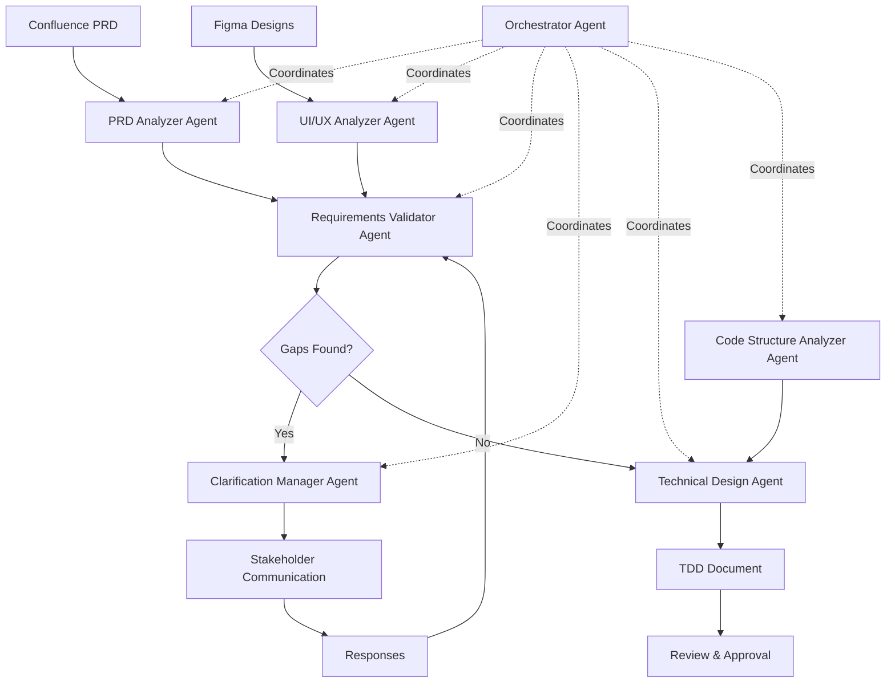

# CLAUDE.md

This file provides guidance to Claude Code (claude.ai/code) when working with code in this repository.

## Multi-Agent System for PRD-to-TDD Automation

This repository contains the implementation of a multi-agent system designed to automate the software development process from Product Requirements Document (PRD) to Technical Design Document (TDD).

## System Architecture Overview

The system follows a hybrid architecture pattern:
- **Monolith**: Contains most existing business logic
- **Microservices**: New and decoupled functionality
- **React SPA**: Frontend application

## Agent Architecture

### 1. Orchestrator Agent (Central Coordinator)
**Role**: Manages the entire workflow, coordinates between agents, and maintains state

**Capabilities**:
- Workflow state management
- Agent task assignment and monitoring
- Decision routing based on outcomes
- Stakeholder notification management
- Progress tracking and reporting

**MCPs Required**:
- Workflow Engine MCP (e.g., Temporal/Airflow integration)
- Notification Service MCP (Slack/Email)
- State Store MCP (Redis/PostgreSQL)

**Commands**:
```bash
# Start discovery process
mt-prism orchestrate start --prd-url <confluence-url> --figma-url <figma-url>

# Check workflow status
mt-prism orchestrate status --workflow-id <id>

# Approve/reject findings
mt-prism orchestrate review --workflow-id <id> --action <approve|reject>
```

### 2. PRD Analyzer Agent
**Role**: Extracts, analyzes, and structures PRD content from Confluence

**Capabilities**:
- Parse Confluence pages and extract structured requirements
- Identify functional and non-functional requirements
- Detect ambiguities and missing information
- Create requirement dependency graphs
- Generate requirement traceability matrix

**MCPs Required**:
- Atlassian Confluence MCP
- Natural Language Processing MCP
- Document Parser MCP (for attachments)

**Commands**:
```bash
# Analyze PRD
mt-prism prd analyze --url <confluence-url> --output <json|markdown>

# Extract requirements
mt-prism prd extract-requirements --prd-id <id> --type <functional|non-functional|all>

# Validate completeness
mt-prism prd validate --prd-id <id> --template <template-path>
```

### 3. UI/UX Analyzer Agent
**Role**: Analyzes Figma designs and extracts UI specifications

**Capabilities**:
- Extract component specifications from Figma
- Identify UI patterns and design system usage
- Map UI components to functional requirements
- Detect inconsistencies with design system
- Generate component inventory

**MCPs Required**:
- Figma API MCP
- Image Recognition MCP (for screenshot analysis)
- Design Token MCP

**Commands**:
```bash
# Analyze Figma designs
mt-prism figma analyze --url <figma-url> --project <project-id>

# Extract components
mt-prism figma extract-components --file-id <id> --format <json|react>

# Check design consistency
mt-prism figma validate-consistency --file-id <id> --design-system <path>
```

### 4. Requirements Validator Agent
**Role**: Cross-references PRD and Figma to identify gaps and inconsistencies

**Capabilities**:
- Compare PRD requirements with UI mockups
- Identify missing UI elements for requirements
- Detect UI elements without backing requirements
- Flag technical feasibility concerns
- Generate clarification questions

**MCPs Required**:
- Requirement Matching MCP
- Knowledge Base MCP (for domain rules)
- Issue Tracking MCP (Jira)

**Commands**:
```bash
# Validate requirements
mt-prism validate cross-check --prd-id <id> --figma-id <id>

# Generate questions
mt-prism validate generate-questions --validation-id <id> --stakeholder <product|design|engineering>

# Check feasibility
mt-prism validate feasibility --requirements <path> --architecture <monolith|microservice>
```

### 5. Clarification Manager Agent
**Role**: Manages the iterative clarification loop with stakeholders

**Capabilities**:
- Categorize and prioritize questions
- Route questions to appropriate stakeholders
- Track response status
- Consolidate answers
- Update requirements based on responses

**MCPs Required**:
- Communication Platform MCP (Slack/Teams)
- Issue Tracking MCP (Jira)
- Document Update MCP (Confluence)

**Commands**:
```bash
# Send clarification requests
mt-prism clarify send --questions <file> --to <product|design|engineering>

# Track responses
mt-prism clarify status --batch-id <id>

# Apply clarifications
mt-prism clarify apply --response-id <id> --target <prd|figma>
```

### 6. Technical Design Agent
**Role**: Generates TDD based on validated requirements

**Capabilities**:
- Generate technical architecture proposals
- Create API specifications
- Define database schemas
- Specify integration points
- Generate implementation tasks and estimates

**MCPs Required**:
- Code Repository MCP (Git)
- OpenAPI Spec Generator MCP
- Database Schema MCP
- Architecture Decision Records MCP

**Commands**:
```bash
# Generate TDD
mt-prism tdd generate --requirements <path> --template <template-id>

# Create API specs
mt-prism tdd api-spec --tdd-id <id> --format <openapi|graphql>

# Generate tasks
mt-prism tdd create-tasks --tdd-id <id> --platform <jira|github>
```

### 7. Code Structure Analyzer Agent
**Role**: Analyzes existing codebase to inform technical decisions

**Capabilities**:
- Analyze monolith structure and dependencies
- Map microservice boundaries
- Identify reusable components
- Suggest implementation patterns
- Detect potential conflicts

**MCPs Required**:
- Code Analysis MCP (AST parsing)
- Dependency Graph MCP
- Git History MCP

**Commands**:
```bash
# Analyze codebase
mt-prism code analyze --repo <path> --type <monolith|microservice|frontend>

# Find similar implementations
mt-prism code find-similar --requirement <desc> --repo <path>

# Check impact
mt-prism code impact-analysis --changes <proposed-changes.json>
```

## Data Flow & Orchestration



## Integration Requirements

### Required APIs & Access
- **Confluence API**: Read/write access to PRD space
- **Figma API**: Read access to design files
- **Jira API**: Create/update issues for tracking
- **Git Repository**: Read access for code analysis
- **Slack/Teams API**: For stakeholder communication
- **OpenAI/Anthropic API**: For NLP and generation tasks

### Data Formats
```yaml
# Standard Requirement Format
requirement:
  id: REQ-001
  type: functional|non-functional
  description: string
  acceptance_criteria: []
  ui_components: []
  api_endpoints: []
  dependencies: []
  priority: high|medium|low
  status: draft|validated|approved
```

### Environment Variables
```bash
# Confluence
CONFLUENCE_URL=https://your-domain.atlassian.net
CONFLUENCE_TOKEN=<token>
CONFLUENCE_SPACE_KEY=<space>

# Figma
FIGMA_ACCESS_TOKEN=<token>
FIGMA_TEAM_ID=<team-id>

# Communication
SLACK_TOKEN=<token>
SLACK_CHANNEL_PRODUCT=<channel-id>
SLACK_CHANNEL_DESIGN=<channel-id>
SLACK_CHANNEL_ENGINEERING=<channel-id>

# Repository
GIT_REPO_URL=<url>
GIT_TOKEN=<token>

# AI Services
OPENAI_API_KEY=<key>
ANTHROPIC_API_KEY=<key>
```

## Automation Workflows

### 1. Discovery Initiation
```bash
# Triggered by PRD publication in Confluence
mt-prism workflow start-discovery \
  --prd-url <confluence-url> \
  --figma-url <figma-url> \
  --assignee <email> \
  --deadline <date>
```

### 2. Continuous Validation
```bash
# Run validation checks on schedule
mt-prism workflow schedule-validation \
  --frequency daily \
  --time 09:00 \
  --notify-on <changes|errors|always>
```

### 3. TDD Generation
```bash
# Generate TDD after approval
mt-prism workflow generate-tdd \
  --validated-requirements <path> \
  --template standard \
  --output-format <confluence|markdown|pdf>
```

## Development Commands

### Setup & Configuration
```bash
# Initialize the multi-agent system
npm install
npm run setup:agents

# Configure agent connections
npm run config:confluence
npm run config:figma
npm run config:git

# Run agent tests
npm test:agents
```

### Running Agents
```bash
# Start all agents in development mode
npm run dev:agents

# Start specific agent
npm run agent:prd-analyzer
npm run agent:ui-analyzer
npm run agent:validator

# Monitor agent health
npm run monitor:agents
```

### Building & Deployment
```bash
# Build agent containers
docker-compose build

# Deploy to Kubernetes
kubectl apply -f k8s/agents/

# Scale agents
kubectl scale deployment prd-analyzer --replicas=3
```

## Architecture Considerations

### For Monolith Integration
- Agents should respect existing transaction boundaries
- Use database views for read-only operations
- Implement circuit breakers for monolith API calls
- Cache frequently accessed monolith data

### For Microservices
- Each agent can be deployed as a separate microservice
- Use event-driven communication where appropriate
- Implement saga patterns for distributed transactions
- Use service mesh for inter-agent communication

### For React SPA
- Generate TypeScript interfaces from requirements
- Create component stubs based on Figma analysis
- Generate Storybook stories for UI components
- Provide React Query hooks for API integration

## Testing Strategy

```bash
# Unit tests for individual agents
npm run test:unit

# Integration tests for agent interactions
npm run test:integration

# End-to-end workflow tests
npm run test:e2e

# Load testing for agent scalability
npm run test:load
```

## Monitoring & Observability

```bash
# View agent logs
mt-prism logs --agent <agent-name> --tail 100

# Check agent metrics
mt-prism metrics --agent <agent-name> --period 1h

# View workflow traces
mt-prism trace --workflow-id <id>

# Generate performance report
mt-prism report --from <date> --to <date> --output report.pdf
```

## Prerequisites

1. **Access Tokens**: All API tokens must be configured
2. **Template Library**: TDD templates must be defined
3. **Design System**: Component library must be documented
4. **Validation Rules**: Business rules must be codified
5. **Communication Channels**: Slack/Teams channels must be set up

## Next Steps

1. Implement core agent framework
2. Create MCP adapters for each integration
3. Define workflow templates
4. Set up monitoring infrastructure
5. Create training data for ML components
6. Deploy in staging environment
7. Run pilot with single project
8. Iterate based on feedback
9. Scale to full deployment