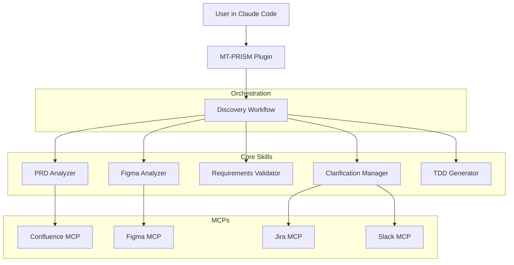

# MT-PRISM: PRD Requirements Intelligent System Manager

## Claude Code Plugin Architecture for PRD-to-TDD Automation

This document outlines the MT-PRISM system architecture, designed as a Claude Code plugin that automates the flow from Product Requirements Documents (PRD) to Technical Design Documents (TDD).

### Document Version
- **Version**: 3.0.0
- **Last Updated**: 2025-11-05
- **Status**: Implementation Ready
- **Approach**: Claude Code Plugin (Primary), Multi-Agent System (Future)
- **Related Documents**: [PLUGIN_PROPOSAL.md](docs/planning/PLUGIN_PROPOSAL.md), [CLAUDE.md](CLAUDE.md)

---

## Executive Summary

MT-PRISM transforms business requirements into technical specifications through intelligent AI-powered automation. The system reduces the PRD-to-TDD cycle from weeks to minutes while maintaining quality and stakeholder alignment.

### Two Implementation Paths

#### Path 1: Claude Code Plugin (Recommended - Current Focus)

**Key Characteristics**:
- **Development Time**: 4-5 weeks
- **Cost**: ~$60K Year 1
- **Infrastructure**: Zero (runs in Claude Code)
- **Team Size**: 1-2 engineers
- **Deployment**: Plugin installation
- **Scalability**: Per-user (Claude Code sessions)

**Target Metrics**:
- **Processing Time**: < 20 minutes for standard PRD (end-to-end)
- **Coverage**: >95% requirement extraction accuracy
- **Gap Detection**: >90% accuracy
- **TDD Generation**: < 5 minutes

#### Path 2: Full Multi-Agent System (Future Expansion)

**Key Characteristics**:
- **Development Time**: 20 weeks
- **Cost**: ~$1.3M Year 1
- **Infrastructure**: Kubernetes, PostgreSQL, Redis, Kafka
- **Team Size**: 9-12 engineers
- **Deployment**: Cloud infrastructure
- **Scalability**: Unlimited concurrent workflows

**When to Expand**: After plugin validates the approach with 10+ successful projects and demonstrates need for enterprise scale.

---

## 1. Plugin Architecture (Current Implementation)

### 1.1 System Overview



### 1.2 Core Skills

#### Skill 1: PRD Analyzer (`prism.analyze-prd`)

**Purpose**: Extract and structure requirements from PRDs

**Inputs**:
- Confluence URL or local file (.md, .pdf, .docx)
- Optional: PRD validation template

**Capabilities**:
- Natural language processing for requirement extraction
- Requirement categorization (functional, non-functional, constraints)
- Ambiguity detection and flagging
- Dependency mapping between requirements
- Confidence scoring for each extraction
- Issue identification (missing criteria, vague language, conflicts)

**Outputs**:
- `requirements.yaml`: Structured requirements with metadata
- `requirements-graph.mmd`: Mermaid dependency diagram
- `prd-analysis-report.md`: Human-readable summary

**Performance Targets**:
- Processing time: < 2 minutes
- Extraction accuracy: > 95%
- False positive rate: < 3%

**Implementation**:
```typescript
// Core skill implementation pattern
export async function analyzePRD(options: {
  prdContent: string;
  prdSource: string;
  outputDir: string;
}): Promise<RequirementsOutput> {
  // Load Claude prompt template
  const prompt = loadPrompt('prd-analyzer', {
    PRD_CONTENT: options.prdContent
  });

  // Call Claude with optimized settings
  const response = await callClaude(prompt, {
    temperature: 0,    // Deterministic analysis
    maxTokens: 8000
  });

  // Parse and validate output
  const requirements = parseYAML(response);
  validateSchema(requirements, RequirementsSchema);

  // Save outputs
  await saveOutputs(options.outputDir, requirements);

  return requirements;
}
```

---

#### Skill 2: Figma Analyzer (`prism.analyze-figma`)

**Purpose**: Extract UI specifications from Figma designs

**Inputs**:
- Figma file URL or ID
- Optional: Design system reference for consistency checking

**Capabilities**:
- Component extraction (atoms, molecules, organisms)
- Design token extraction (colors, typography, spacing)
- UI pattern recognition (forms, modals, tables, navigation)
- Component state identification (default, hover, disabled, etc.)
- Screenshot generation for components
- Design system consistency validation

**Outputs**:
- `components.yaml`: Component inventory with specifications
- `design-tokens.json`: Extracted design tokens
- `figma-analysis-report.md`: Analysis summary
- `screenshots/`: Component screenshots

**Performance Targets**:
- Processing time: < 3 minutes for 20-50 screens
- Component extraction accuracy: > 95%
- Design token completeness: > 90%

**MCP Integration**:
```typescript
// Figma MCP usage
const figmaClient = await connectMCP('figma');

// Fetch design file
const fileData = await figmaClient.getFile(fileId);

// Extract component details
const components = await figmaClient.getFileComponents(fileId);

// Get design tokens (styles)
const styles = await figmaClient.getFileStyles(fileId);
```

---

#### Skill 3: Requirements Validator (`prism.validate`)

**Purpose**: Cross-validate PRD requirements against Figma designs

**Inputs**:
- `requirements.yaml` (from PRD analysis)
- `components.yaml` (from Figma analysis)
- Optional: Codebase path for technical feasibility check

**Capabilities**:
- Requirement-to-component mapping with confidence scoring
- Gap detection (5 types):
  1. **Missing UI**: Requirements without corresponding components
  2. **No Requirement**: Components without backing requirements
  3. **Incomplete Mapping**: Partial UI coverage
  4. **Inconsistencies**: Conflicts between PRD and Figma
  5. **Missing Acceptance Criteria**: Requirements lacking testable conditions
- Technical feasibility assessment
- Clarification question generation
- Traceability matrix creation

**Outputs**:
- `validation-report.md`: Comprehensive validation results
- `gaps.yaml`: Structured gap list with severity
- `clarification-questions.md`: Specific, actionable questions
- `requirement-component-map.yaml`: Full traceability matrix

**Performance Targets**:
- Processing time: < 3 minutes
- Gap detection accuracy: > 90%
- Zero false negatives on critical gaps

**Validation Logic**:
```typescript
// Gap detection example
async function detectGaps(
  requirements: Requirement[],
  components: Component[]
): Promise<Gap[]> {
  const gaps: Gap[] = [];

  for (const req of requirements) {
    // Find matching components
    const matches = await mapToComponents(req, components);

    if (matches.length === 0) {
      gaps.push({
        type: 'missing_ui',
        severity: 'critical',
        requirement: req.id,
        description: `No UI component found for ${req.title}`
      });
    } else if (matches.confidence < 0.85) {
      gaps.push({
        type: 'incomplete_mapping',
        severity: 'high',
        requirement: req.id,
        components: matches.ids,
        description: `Partial UI coverage for ${req.title}`
      });
    }
  }

  return gaps;
}
```

---

#### Skill 4: Clarification Manager (`prism.clarify`)

**Purpose**: Manage iterative clarification loop with stakeholders

**Inputs**:
- `clarification-questions.md` (from validation)
- Stakeholder mapping configuration

**Capabilities**:
- Question categorization by stakeholder type (product, design, engineering)
- Question prioritization (critical → high → medium → low)
- Multi-channel distribution:
  - **Interactive**: Real-time Q&A with user in Claude Code
  - **Jira**: Create tracking tickets
  - **Slack**: Send messages to channels
  - **Email**: Formal communication
  - **File**: Generate files for manual distribution
- Response collection and parsing
- Automatic requirement updates
- Re-validation triggering

**Outputs**:
- `clarification-summary.md`: Session summary
- `responses.yaml`: All collected answers
- `updated-requirements.yaml`: Requirements with clarifications applied
- `updated-components.yaml`: Component updates (if needed)

**Performance Targets**:
- Interactive mode: Real-time response
- Question delivery: 100% success rate
- Response accuracy: > 95% correct parsing

**Interactive Flow**:
```typescript
// Interactive clarification example
async function interactiveClarification(
  questions: Question[]
): Promise<Response[]> {
  const responses: Response[] = [];

  for (const question of sortByPriority(questions)) {
    console.log(`\nQuestion ${question.id} (${question.priority})`);
    console.log(question.text);
    console.log('\nSuggestions:');
    question.suggestions.forEach((s, i) =>
      console.log(`  ${i + 1}) ${s}`)
    );

    const answer = await getUserInput();
    responses.push({
      questionId: question.id,
      answer: answer,
      timestamp: new Date()
    });
  }

  return responses;
}
```

---

#### Skill 5: TDD Generator (`prism.generate-tdd`)

**Purpose**: Generate comprehensive Technical Design Document

**Inputs**:
- `requirements.yaml` (validated, preferably clarified)
- `components.yaml` (optional)
- Codebase path (optional)
- Tech stack preference

**Capabilities**:
- System architecture design (monolith/microservices/hybrid decision)
- API specification generation (OpenAPI 3.1)
- Database schema design with indexes
- Frontend architecture with component mapping
- Implementation task breakdown
- Effort estimation (story points)
- Security and performance considerations
- Testing strategy definition

**Outputs**:
- `TDD.md`: Comprehensive 30-50 page document
- `api-spec.yaml`: Valid OpenAPI 3.1 specification
- `database-schema.sql`: Executable SQL DDL
- `tasks.json`: Implementation task list (Jira-ready)
- `types.ts`: TypeScript interfaces from API spec
- `architecture-diagram.mmd`: Mermaid system diagram

**TDD Structure** (12 main sections):
1. Executive Summary
2. Requirements Summary
3. System Architecture
4. Data Models
5. API Specification
6. Frontend Architecture
7. Security Considerations
8. Performance & Scalability
9. Testing Strategy
10. Deployment & DevOps
11. Implementation Plan
12. Open Questions & Decisions

**Performance Targets**:
- Processing time: < 5 minutes
- Requirements coverage: 100%
- API spec validity: Must pass OpenAPI validation
- SQL executability: Must run without errors

---

### 1.3 Orchestration Workflow

#### Full Discovery Workflow (`prism.discover`)

**Purpose**: Execute complete PRD-to-TDD process end-to-end

**Workflow Steps**:

```typescript
async function discoverWorkflow(options: {
  prdUrl: string;
  figmaUrl: string;
  outputDir: string;
  clarificationMode: 'interactive' | 'jira' | 'slack';
}): Promise<TDD> {

  // Step 1: Initialize session
  const session = initializeSession(options.outputDir);

  // Step 2: Analyze PRD
  console.log('[1/5] Analyzing PRD...');
  const requirements = await analyzePRD({
    prdUrl: options.prdUrl,
    outputDir: `${session.dir}/01-prd-analysis`
  });

  // Step 3: Analyze Figma
  console.log('[2/5] Analyzing Figma...');
  const components = await analyzeFigma({
    figmaUrl: options.figmaUrl,
    outputDir: `${session.dir}/02-figma-analysis`
  });

  // Step 4: Validate
  console.log('[3/5] Validating requirements...');
  const validation = await validateRequirements({
    requirements,
    components,
    outputDir: `${session.dir}/03-validation`
  });

  // Step 5: Clarify (if needed)
  if (validation.status === 'NEEDS_CLARIFICATION') {
    console.log('[4/5] Clarifying gaps...');

    const clarifications = await clarify({
      questions: validation.questions,
      mode: options.clarificationMode,
      outputDir: `${session.dir}/04-clarification`
    });

    // Update requirements
    requirements = applyClarifications(requirements, clarifications);

    // Re-validate
    validation = await validateRequirements({
      requirements,
      components,
      outputDir: `${session.dir}/03-validation-iter2`
    });
  }

  // Step 6: Generate TDD
  console.log('[5/5] Generating TDD...');
  const tdd = await generateTDD({
    requirements,
    components,
    outputDir: `${session.dir}/05-tdd`
  });

  // Complete
  console.log('🎉 Discovery complete!');
  return tdd;
}
```

**Error Handling & Recovery**:
- Checkpoint-based state saving
- Resume capability from any step
- Graceful degradation for failed services
- Comprehensive error messages with recovery suggestions

---

## 2. Model Context Protocol (MCP) Integrations

### 2.1 Required MCPs

#### Confluence MCP (Atlassian)
**Status**: ✅ Already implemented in mt-osiris

**Endpoints Used**:
```javascript
// Read PRDs
confluence.getPage(pageId)
confluence.getPageContent(pageId)
confluence.getPageAttachments(pageId)

// Write TDDs
confluence.createPage(space, title, content)
confluence.updatePage(pageId, newContent)

// Comments for clarifications
confluence.getComments(pageId)
confluence.addComment(pageId, comment)
```

#### Figma MCP
**Status**: 🔨 To be implemented

**Endpoints Needed**:
```javascript
// Design access
figma.getFile(fileId)
figma.getFileComponents(fileId)
figma.getFileStyles(fileId)
figma.exportImage(nodeId, format, scale)

// Comments/discussions
figma.getComments(fileId)
figma.postComment(fileId, message, position)
```

**Implementation Priority**: High (Week 2)

#### Jira MCP
**Status**: 🔨 To be implemented

**Purpose**: Create clarification tickets

```javascript
// Issue management
jira.createIssue(project, issueType, summary, description)
jira.updateIssue(issueId, fields)
jira.getIssue(issueId)
jira.searchIssues(jql)
jira.addComment(issueId, comment)
```

#### Slack MCP
**Status**: 🔨 To be implemented

**Purpose**: Async stakeholder communication

```javascript
// Messaging
slack.sendMessage(channel, message, blocks)
slack.sendInteractiveMessage(channel, blocks, actions)
slack.getThreadReplies(channel, timestamp)

// Users
slack.getUserInfo(userId)
slack.listChannels()
```

### 2.2 MCP Architecture Pattern

```typescript
// Standard MCP client pattern
class MCPClient {
  constructor(private serverName: string) {}

  async connect(): Promise<void> {
    // Establish MCP connection
  }

  async call<T>(method: string, params: unknown): Promise<T> {
    // JSON-RPC over MCP transport
    const request = {
      jsonrpc: '2.0',
      method,
      params,
      id: generateId()
    };

    const response = await this.transport.send(request);

    if (response.error) {
      throw new MCPError(response.error);
    }

    return response.result as T;
  }
}

// Usage in skills
const confluence = new MCPClient('confluence');
await confluence.connect();
const page = await confluence.call('getPage', { pageId: '123' });
```

---

## 3. Data Formats & Standards

### 3.1 Requirements Schema

```yaml
# requirements.yaml structure
metadata:
  prd_source: string              # URL or file path
  analyzed_at: string             # ISO8601 timestamp
  analyzer_version: string        # "1.0"
  total_requirements: number

requirements:
  - id: string                    # REQ-FUNC-001
    type: enum                    # functional | non-functional | constraint
    category: enum                # feature | enhancement | bug-fix
    priority: enum                # critical | high | medium | low
    complexity: number            # 1-10
    title: string
    description: string
    acceptance_criteria: string[]
    user_stories: string[]
    dependencies: string[]        # Other requirement IDs
    source_location: string
    confidence: number            # 0.0-1.0
    status: enum                  # draft | validated | clarified
    issues: object[]
```

### 3.2 Components Schema

```yaml
# components.yaml structure
metadata:
  figma_file_id: string
  figma_file_name: string
  analyzed_at: string
  total_components: number

components:
  - id: string                    # COMP-001
    name: string                  # "Button/Primary/Large"
    type: string                  # Button | Input | Card
    category: enum                # atom | molecule | organism
    description: string
    variants: object[]
    properties: object[]
    composition: object[]
    usage: object
    design_tokens: object
    screenshot: string
```

### 3.3 Gaps Schema

```yaml
# gaps.yaml structure
gaps:
  - id: string                    # GAP-001
    type: enum                    # missing_ui | no_requirement | inconsistency
    severity: enum                # critical | high | medium | low
    requirement_id: string
    component_id: string
    description: string
    impact: string
    stakeholder: string[]
    question_id: string           # Link to clarification question
```

---

## 4. Development Roadmap

### Phase 1: Core Plugin Framework (Week 1) ✅

**Deliverables**:
- [x] Project structure
- [x] TypeScript configuration
- [x] Claude API client
- [x] Prompt loader utility
- [x] File I/O utilities
- [x] Complete documentation

**Status**: Complete

### Phase 2: Analysis Skills (Week 2)

**Tasks**:
- [ ] Implement PRD Analyzer skill
  - Claude prompt template
  - YAML output generation
  - Validation logic
- [ ] Implement Figma Analyzer skill
  - Figma MCP integration
  - Component extraction
  - Design token parsing
- [ ] Create test suite with sample data
- [ ] Documentation and examples

**Deliverables**:
- PRD Analyzer fully functional
- Figma Analyzer fully functional
- 90%+ test coverage

### Phase 3: Validation & Clarification (Week 3)

**Tasks**:
- [ ] Implement Requirements Validator
  - Gap detection algorithms
  - Requirement-component mapping
  - Question generation
- [ ] Implement Clarification Manager
  - Interactive mode
  - Jira/Slack integration
  - Response parsing
- [ ] Integration tests

**Deliverables**:
- Complete validation pipeline
- Multi-channel clarification
- End-to-end validation tested

### Phase 4: TDD Generation & Orchestration (Week 4)

**Tasks**:
- [ ] Implement TDD Generator
  - Template system
  - Section generators
  - Artifact generation (OpenAPI, SQL, tasks)
- [ ] Implement Discovery Workflow
  - Full orchestration
  - Error handling
  - Progress reporting
  - Resume capability

**Deliverables**:
- Complete TDD generation
- Full workflow functional
- Error recovery tested

### Phase 5: Testing & Launch (Week 5)

**Tasks**:
- [ ] Comprehensive testing
  - Unit tests (80%+ coverage)
  - Integration tests
  - End-to-end tests
  - Performance tests
- [ ] Beta testing with 3-5 users
- [ ] Documentation polish
- [ ] Public release

**Deliverables**:
- Production-ready plugin
- Complete documentation
- Beta user feedback incorporated

---

## 5. Future: Multi-Agent System (Optional Expansion)

### When to Expand

Consider building the full multi-agent system when:
- ✅ Plugin validates approach (10+ successful projects)
- ✅ Need >10 concurrent workflows regularly
- ✅ Need scheduled/automated workflows
- ✅ Need enterprise dashboards and APIs
- ✅ Have budget ($1.3M+) and team (9-12 engineers)

### Architecture Changes for Full System

**Additional Components**:
- **Orchestration**: Temporal or Airflow for workflow management
- **Message Queue**: Kafka for agent communication
- **Databases**: PostgreSQL (primary), Redis (cache), Neo4j (graphs)
- **API Layer**: Fastify/tRPC for external access
- **Web Dashboard**: Next.js for monitoring
- **Infrastructure**: Kubernetes for scaling

**Agent Separation**:
- Each skill becomes an independent agent/service
- Event-driven communication via Kafka
- Distributed state management
- Horizontal scaling capability

**Migration Path**:
- Reuse 70-80% of skill logic (prompts, algorithms)
- Add infrastructure layer
- Implement event bus
- Build web dashboard
- Estimated: 12-16 weeks (vs. 20 weeks greenfield)

---

## 6. Performance & Quality Metrics

### Target Metrics

| Metric | Target | Measurement Method |
|--------|--------|-------------------|
| PRD Analysis Time | < 2 min | Claude API time + processing |
| Figma Analysis Time | < 3 min | MCP fetch + Claude processing |
| Validation Time | < 3 min | Mapping algorithm + gap detection |
| Clarification Time | 5-10 min | User interaction (interactive mode) |
| TDD Generation Time | < 5 min | Template population + artifacts |
| **End-to-End Time** | **< 20 min** | **Full workflow (excluding wait time)** |

### Quality Metrics

| Metric | Target | Validation Method |
|--------|--------|-------------------|
| Requirement Extraction Accuracy | > 95% | Manual review vs. automated |
| Component Extraction Accuracy | > 95% | Manual count vs. automated |
| Gap Detection Rate | > 90% | False negative analysis |
| TDD Quality Rating | 4.5/5 | User satisfaction survey |
| Requirements Coverage | 100% | All reqs in TDD check |

### Cost Metrics

| Metric | Plugin | Full System |
|--------|--------|-------------|
| Development Cost | $54,000 | $1,260,000 |
| Year 1 Infrastructure | $0 | $61,200 |
| Annual Operating Cost | $6,000 | $461,200 |
| Cost per Workflow | ~$3 | ~$10 |

---

## 7. Testing Strategy

### Unit Testing

```typescript
// Example unit test
describe('PRD Analyzer', () => {
  it('should extract requirements from simple PRD', async () => {
    const prd = 'Users must be able to login';
    const result = await analyzePRD({ prdContent: prd });

    expect(result.requirements.length).toBeGreaterThan(0);
    expect(result.requirements[0].type).toBe('functional');
  });

  it('should detect ambiguities', async () => {
    const prd = 'Application should be fast';
    const result = await analyzePRD({ prdContent: prd });

    const hasAmbiguity = result.requirements[0].issues
      .some(i => i.type === 'ambiguity');
    expect(hasAmbiguity).toBe(true);
  });
});
```

**Coverage Target**: 80%+ for all skills

### Integration Testing

```typescript
// Example integration test
describe('Full Workflow', () => {
  it('should complete PRD to TDD workflow', async () => {
    const result = await discoverWorkflow({
      prdUrl: 'test/fixtures/sample-prd.md',
      figmaUrl: 'test/fixtures/sample-figma.json',
      outputDir: './test-output',
      clarificationMode: 'skip'
    });

    expect(result.tdd).toBeDefined();
    expect(result.apiSpec).toBeDefined();
    expect(result.databaseSchema).toBeDefined();
  });
});
```

### Performance Testing

```bash
# Benchmark all skills
npm run benchmark

# Expected results:
# - PRD Analyzer: < 2 min for 10-page PRD
# - Figma Analyzer: < 3 min for 30-screen design
# - Validator: < 3 min for 20 reqs + 40 components
# - TDD Generator: < 5 min for complete TDD
```

---

## 8. Success Criteria

### Phase 1-2 (Weeks 1-2): Analysis
- [ ] PRD Analyzer: 95%+ accuracy on test corpus
- [ ] Figma Analyzer: 95%+ component extraction
- [ ] Both skills complete in target time
- [ ] Unit tests passing (80%+ coverage)

### Phase 3 (Week 3): Validation
- [ ] Validator: 90%+ gap detection
- [ ] Clarification Manager: All modes functional
- [ ] Integration tests passing
- [ ] No critical bugs

### Phase 4 (Week 4): Generation
- [ ] TDD Generator: 100% requirements covered
- [ ] Valid OpenAPI spec generated
- [ ] Executable SQL generated
- [ ] Full workflow tested end-to-end

### Phase 5 (Week 5): Launch
- [ ] 3+ beta users complete workflows successfully
- [ ] 4.5/5+ average satisfaction
- [ ] All documentation complete
- [ ] Zero critical bugs
- [ ] Production deployment successful

---

## 9. Monitoring & Observability (Plugin)

### Metrics to Track

```typescript
// Simple metric tracking for plugin
interface WorkflowMetrics {
  workflowId: string;
  duration: {
    prdAnalysis: number;      // milliseconds
    figmaAnalysis: number;
    validation: number;
    clarification: number;
    tddGeneration: number;
    total: number;
  };
  quality: {
    requirementsExtracted: number;
    componentsExtracted: number;
    gapsFound: number;
    questionsAsked: number;
  };
  success: boolean;
  error?: string;
  timestamp: Date;
}

// Log metrics for analysis
function logWorkflowMetrics(metrics: WorkflowMetrics) {
  const logFile = '.prism/metrics.jsonl';
  appendFileSync(logFile, JSON.stringify(metrics) + '\n');
}
```

### User Feedback Collection

```typescript
// Post-workflow feedback
async function collectFeedback(workflowId: string) {
  console.log('\n📊 Quick Feedback:');
  console.log('How satisfied are you with the TDD quality? (1-5)');
  const rating = await getUserInput();

  console.log('Any issues or suggestions?');
  const feedback = await getUserInput();

  saveFeedback({ workflowId, rating, feedback });
}
```

---

## 10. Security & Privacy

### Data Handling

**What Goes to Claude API**:
- PRD content (requirements, descriptions)
- Figma component data (names, properties)
- Validation results
- Clarification Q&A

**What Stays Local**:
- API keys and tokens
- User responses
- Generated TDD files
- Metrics and logs

### Best Practices

```typescript
// Environment variable management
import { config } from 'dotenv';
config(); // Load from .env file

// Never commit credentials
const ANTHROPIC_KEY = process.env.ANTHROPIC_API_KEY;
if (!ANTHROPIC_KEY) {
  throw new Error('ANTHROPIC_API_KEY not set');
}

// Sanitize sensitive data before logging
function sanitizeForLogging(data: any): any {
  const sensitive = ['apiKey', 'token', 'password', 'secret'];
  // ... redact sensitive fields
}
```

### Compliance

- **GDPR**: User can delete all workflow data
- **SOC2**: Audit logs for all API calls
- **Data Retention**: 30 days default (configurable)

---

## 11. Integration with Existing mt-osiris Work

This plugin extends the mt-osiris-claude-code-plugins ecosystem:

### Leveraging Existing Assets

- ✅ **Atlassian MCP**: Reuse existing Confluence integration
- ✅ **Spec-Kit**: Apply principles for structured prompts
- ✅ **PNPM Workspace**: Use monorepo structure
- ✅ **Documentation Patterns**: Follow established formats

### Project Structure

```
mt-prism/                        # This repository
├── docs/                        # Comprehensive docs (complete)
├── prompts/                     # Claude prompts (complete)
├── templates/                   # Output schemas (complete)
├── src/                         # Implementation (to be built)
│   ├── skills/                  # 5 core skills
│   ├── workflow/                # Orchestration
│   ├── utils/                   # Shared utilities
│   └── types/                   # TypeScript types
└── tests/                       # Test suite
```

---

## 12. Summary & Next Steps

### What We Have

✅ **Complete Documentation** (23 files, ~250 pages):
- Architecture specifications
- Skill specifications
- Prompt templates
- Output schemas
- Implementation guides

✅ **Clear Implementation Path**:
- 5-week roadmap
- Detailed specifications
- Testing strategy
- Success criteria

✅ **Production-Ready Prompts**:
- Optimized for Claude
- With few-shot examples
- Quality checklists included

### What to Build

**Week 1**: Core framework + utilities
**Week 2**: PRD & Figma analyzers
**Week 3**: Validator & clarification
**Week 4**: TDD generator & workflow
**Week 5**: Testing & launch

### Getting Started

1. **Read**: `QUICKSTART.md` - 1-hour implementation guide
2. **Review**: Skill specs in `docs/specs/`
3. **Use**: Prompts in `prompts/`
4. **Build**: Follow the roadmap

---

## Appendices

### A. Decision Log

| Decision | Rationale | Date |
|----------|-----------|------|
| Plugin-first approach | 95% cost reduction, 80% faster, validates before big investment | 2025-11-05 |
| Claude Sonnet 4.5 | Best balance of quality and cost | 2025-11-05 |
| TypeScript | Type safety, ecosystem, team expertise | 2025-11-05 |
| MCP for integrations | Standard protocol, reusable servers | 2025-11-05 |

### B. References

- [Plugin Proposal](docs/planning/PLUGIN_PROPOSAL.md)
- [Approach Comparison](docs/planning/APPROACH_COMPARISON.md)
- [Skill Specifications](docs/specs/README.md)
- [Quick Start Guide](QUICKSTART.md)

### C. Glossary

- **PRD**: Product Requirements Document
- **TDD**: Technical Design Document
- **MCP**: Model Context Protocol
- **Skill**: Self-contained capability (like an agent)
- **Workflow**: Orchestration of multiple skills

---

**Document Ownership**: MT-PRISM Team
**Last Updated**: 2025-11-05
**Next Review**: After Week 2 implementation
