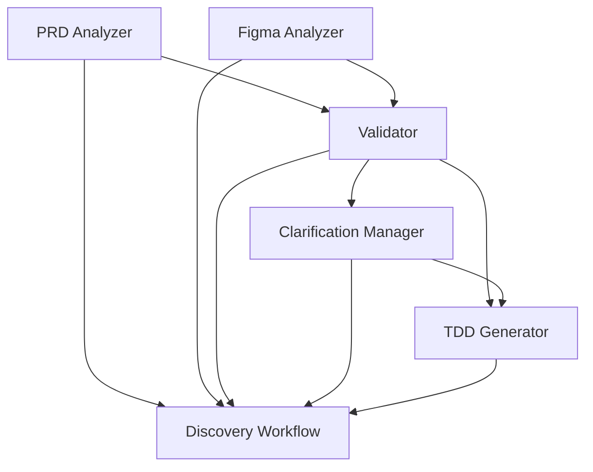

# MT-PRISM Plugin Specifications

**Version**: 1.0
**Date**: 2025-11-05
**Status**: Complete

---

## Overview

This directory contains comprehensive technical specifications for all MT-PRISM Claude Code plugin skills and workflows. Each specification provides detailed implementation guidance including inputs, outputs, processing steps, prompt engineering, error handling, and testing criteria.

---

## Specification Documents

### 1. [PRD Analyzer](./SKILL_PRD_ANALYZER.md)
**Skill**: `prism.analyze-prd`
**Purpose**: Extract and structure requirements from PRDs

**Key Features**:
- Confluence and local file support
- Requirement classification (functional, non-functional, priority)
- Ambiguity detection
- Dependency graph generation
- Confidence scoring

**Inputs**:
- PRD URL (Confluence) or local file (.md, .pdf, .docx)

**Outputs**:
- `requirements.yaml` - Structured requirements
- `requirements-graph.mmd` - Dependency diagram
- `prd-analysis-report.md` - Human-readable summary

**Success Criteria**:
- 95%+ extraction accuracy
- < 2 min processing time
- Valid YAML output

---

### 2. [Figma Analyzer](./SKILL_FIGMA_ANALYZER.md)
**Skill**: `prism.analyze-figma`
**Purpose**: Extract UI specifications from Figma designs

**Key Features**:
- Component extraction (atoms, molecules, organisms)
- Design token extraction (colors, typography, spacing)
- UI pattern recognition (forms, tables, modals)
- Screenshot generation
- Design system consistency checking

**Inputs**:
- Figma file URL or ID

**Outputs**:
- `components.yaml` - Component inventory
- `design-tokens.json` - Extracted design tokens
- `screenshots/` - Component screenshots
- `figma-analysis-report.md` - Summary

**Success Criteria**:
- 95%+ component extraction accuracy
- < 3 min processing time
- All design tokens captured

---

### 3. [Requirements Validator](./SKILL_VALIDATOR.md)
**Skill**: `prism.validate`
**Purpose**: Cross-validate PRD requirements against Figma designs

**Key Features**:
- Requirement-to-component mapping
- Gap detection (5 types)
- Technical feasibility assessment
- Clarification question generation
- Traceability matrix

**Inputs**:
- `requirements.yaml` (from PRD analysis)
- `components.yaml` (from Figma analysis)
- Optional: codebase path

**Outputs**:
- `validation-report.md` - Comprehensive validation results
- `gaps.yaml` - Structured gap list
- `clarification-questions.md` - Actionable questions
- `requirement-component-map.yaml` - Traceability matrix

**Success Criteria**:
- 90%+ gap detection rate
- < 3 min processing time
- Zero false negatives on critical gaps

---

### 4. [Clarification Manager](./SKILL_CLARIFICATION_MANAGER.md)
**Skill**: `prism.clarify`
**Purpose**: Manage iterative clarification loop with stakeholders

**Key Features**:
- Multiple distribution modes (interactive, Jira, Slack, email, file)
- Question categorization by stakeholder type
- Response tracking and collection
- Automated requirement updates
- Re-validation triggering

**Inputs**:
- `clarification-questions.md` (from validation)
- Stakeholder mapping configuration

**Outputs**:
- `clarification-summary.md` - Session summary
- `responses.yaml` - All answers collected
- `updated-requirements.yaml` - Requirements with clarifications applied
- `updated-components.yaml` - Components with updates

**Success Criteria**:
- 100% question delivery rate
- Accurate response capture
- Correct requirement updates

**Modes**:
| Mode | Use Case | Wait Time |
|------|----------|-----------|
| Interactive | Real-time with user | Immediate |
| Jira | Async via tickets | Hours-days |
| Slack | Async via messages | Hours-days |
| Email | Async via email | Days |
| File | Manual distribution | Manual |

---

### 5. [TDD Generator](./SKILL_TDD_GENERATOR.md)
**Skill**: `prism.generate-tdd`
**Purpose**: Generate comprehensive Technical Design Document

**Key Features**:
- System architecture design
- API specification (OpenAPI 3.1)
- Database schema design
- Frontend architecture
- Implementation task breakdown
- Effort estimation
- Supporting artifact generation

**Inputs**:
- `requirements.yaml` (validated, preferably clarified)
- `components.yaml` (optional)
- Codebase path (optional)
- Tech stack preference

**Outputs**:
- `TDD.md` - Comprehensive TDD (30-50 pages)
- `api-spec.yaml` - OpenAPI 3.1 specification
- `database-schema.sql` - Executable SQL
- `tasks.json` - Implementation task list
- `types.ts` - TypeScript interfaces
- `architecture-diagram.mmd` - System architecture

**Success Criteria**:
- 100% requirement coverage
- Valid OpenAPI spec
- Executable SQL schema
- Actionable task breakdown
- 4.5/5 quality rating
- < 5 min processing time

---

### 6. [Full Discovery Workflow](./WORKFLOW_DISCOVERY.md)
**Workflow**: `prism.discover`
**Purpose**: Orchestrate complete PRD-to-TDD process

**Key Features**:
- End-to-end automation
- Error recovery and resume
- Progress tracking
- Iterative clarification loops
- State management
- Session persistence

**Workflow Steps**:
```
1. Initialize Session
   ↓
2. Analyze PRD
   ↓
3. Analyze Figma
   ↓
4. Validate Requirements
   ↓
5. Clarify (if gaps) ←─┐
   ↓                   │
6. Re-validate         │
   ↓                   │
   └── Loop if needed ─┘
   ↓
7. Generate TDD
   ↓
8. Complete
```

**Inputs**:
- PRD URL or file
- Figma URL or file ID
- Configuration (optional)
- Codebase path (optional)

**Outputs**:
- Complete session directory with all intermediate outputs
- Final TDD with all artifacts
- Discovery summary report

**Success Criteria**:
- Complete in single command
- Handle all errors gracefully
- Resume from any failure point
- < 20 min total time (with interactive clarification)
- < 10 min without clarification

---

## Implementation Priority

### Phase 1: Core Skills (Week 1-2)
1. **PRD Analyzer** - Foundation skill
2. **Figma Analyzer** - Parallel to PRD
3. **Validator** - Depends on 1 & 2

### Phase 2: Clarification & TDD (Week 3-4)
4. **Clarification Manager** - Depends on 3
5. **TDD Generator** - Depends on 3 (and optionally 4)

### Phase 3: Orchestration (Week 4)
6. **Discovery Workflow** - Depends on all previous

---

## Skill Dependency Graph



---

## Common Patterns Across Skills

### Input/Output Convention
```
.prism/
├── prd-analysis-{timestamp}/
│   ├── requirements.yaml
│   ├── requirements-graph.mmd
│   └── prd-analysis-report.md
├── figma-analysis-{timestamp}/
│   ├── components.yaml
│   ├── design-tokens.json
│   └── screenshots/
├── validation-{timestamp}/
│   ├── validation-report.md
│   ├── gaps.yaml
│   └── clarification-questions.md
├── clarifications-{timestamp}/
│   ├── responses.yaml
│   └── updated-requirements.yaml
├── tdd-{timestamp}/
│   ├── TDD.md
│   ├── api-spec.yaml
│   └── database-schema.sql
└── sessions/
    └── sess-{timestamp}/
        ├── session_state.yaml
        └── [all outputs organized by step]
```

### Error Handling Pattern
All skills follow this pattern:
1. Validate inputs
2. Execute with progress updates
3. Handle errors gracefully
4. Save state before failing
5. Provide actionable error messages
6. Offer recovery options

### Progress Reporting Pattern
All skills provide:
- Start message with estimated time
- Progress updates during execution
- Completion message with summary
- Output file paths
- Next step suggestions

---

## Data Formats

### requirements.yaml
```yaml
metadata:
  prd_source: string
  analyzed_at: datetime
  total_requirements: number

requirements:
  - id: string              # REQ-FUNC-001
    type: enum              # functional | non-functional | constraint
    category: enum          # feature | enhancement | bug-fix, etc.
    priority: enum          # critical | high | medium | low
    complexity: number      # 1-10
    title: string
    description: string
    acceptance_criteria: string[]
    user_stories: string[]
    dependencies: string[]  # Other requirement IDs
    source_location: string
    confidence: number      # 0.0-1.0
    status: enum            # draft | validated | clarified | approved
    issues: object[]
```

### components.yaml
```yaml
metadata:
  figma_file_id: string
  analyzed_at: datetime
  total_components: number

components:
  - id: string              # COMP-001
    name: string            # "Button/Primary/Large"
    type: string            # Button | Input | Card, etc.
    category: enum          # atom | molecule | organism | template
    description: string
    variants: object[]
    properties: object[]
    composition: object[]
    usage: object
    design_tokens: object
    screenshot: string
```

### gaps.yaml
```yaml
gaps:
  - id: string              # GAP-001
    type: enum              # missing_ui | no_requirement | inconsistency | incomplete_mapping
    severity: enum          # critical | high | medium | low
    requirement_id: string
    component_id: string
    description: string
    impact: string
    stakeholder: string[]   # product | design | engineering
    question_id: string     # Link to clarification question
```

---

## Performance Targets

| Skill | Typical Input | Target Time | Token Usage |
|-------|--------------|-------------|-------------|
| PRD Analyzer | 5-10 page PRD | < 2 min | < 50K |
| Figma Analyzer | 20-50 screens | < 3 min | < 40K |
| Validator | 20 reqs + 40 comps | < 3 min | < 60K |
| Clarification | 10 questions (interactive) | 5-10 min* | < 10K |
| TDD Generator | 20-30 requirements | < 5 min | < 100K |
| **Full Workflow** | **Complete discovery** | **< 20 min** | **< 300K** |

*User interaction time, not processing time

---

## Testing Requirements

Each skill must pass:
- **Unit Tests**: Core logic (90%+ coverage)
- **Integration Tests**: With MCPs and other skills
- **E2E Tests**: Full workflow scenarios
- **Performance Tests**: Meet target times
- **Quality Tests**: Output validation

### Test Data Requirements
Prepare test fixtures:
- 5 sample PRDs (varying complexity)
- 5 sample Figma files (with components)
- Expected outputs for each
- Edge cases and error scenarios

---

## Documentation Standards

Each specification includes:
1. **Overview**: Purpose and goals
2. **Input Parameters**: Required and optional
3. **Processing Steps**: Detailed algorithm
4. **Output Formats**: Schemas and examples
5. **Prompt Engineering**: Guidelines for Claude prompts
6. **Edge Cases**: Unusual scenarios
7. **Error Handling**: All error types
8. **Testing Criteria**: Acceptance criteria
9. **Performance Requirements**: Time and resource limits
10. **Example Usage**: Real-world examples

---

## Next Steps

### For Implementation

1. **Set up development environment**:
   ```bash
   cd mt-prism
   mkdir -p plugin/{prompts,templates,skills,workflows}
   ```

2. **Start with PRD Analyzer**:
   - Create `prompts/prd-analyzer.md`
   - Implement using this specification
   - Test with sample PRDs
   - Iterate until 95%+ accuracy

3. **Move to Figma Analyzer**:
   - Build in parallel if possible
   - Create Figma MCP if not available
   - Test with sample Figma files

4. **Continue through phases**:
   - Follow implementation priority order
   - Test each skill independently
   - Test integrated workflow

5. **Beta testing**:
   - Use with 3-5 real projects
   - Gather feedback
   - Iterate on prompts and logic

### For Review

**Review Checklist**:
- [ ] All specifications complete
- [ ] Consistent terminology across docs
- [ ] All dependencies identified
- [ ] Performance targets realistic
- [ ] Test criteria clear
- [ ] Example outputs valid
- [ ] Error scenarios covered

---

## Related Documents

- [Plugin Proposal](../planning/PLUGIN_PROPOSAL.md) - Overall plugin architecture
- [Implementation Plan](../planning/IMPLEMENTATION_PLAN.md) - Full system plan (reference)
- [Approach Comparison](../planning/APPROACH_COMPARISON.md) - Plugin vs. full system
- [CLAUDE.md](../../CLAUDE.md) - Project overview

---

## Glossary

**PRD**: Product Requirements Document
**TDD**: Technical Design Document
**MCP**: Model Context Protocol
**Figma**: Design tool for UI/UX
**Confluence**: Atlassian wiki/documentation tool
**OpenAPI**: API specification format
**Atomic Design**: Design methodology (atoms, molecules, organisms)
**Story Points**: Agile effort estimation unit

---

## Feedback & Contributions

For questions, issues, or suggestions about these specifications:
- Review with team and provide feedback
- Open issues for ambiguities or missing details
- Propose improvements via pull requests

---

**Document Owner**: MT-PRISM Team
**Last Updated**: 2025-11-05
**Next Review**: After Phase 1 implementation
