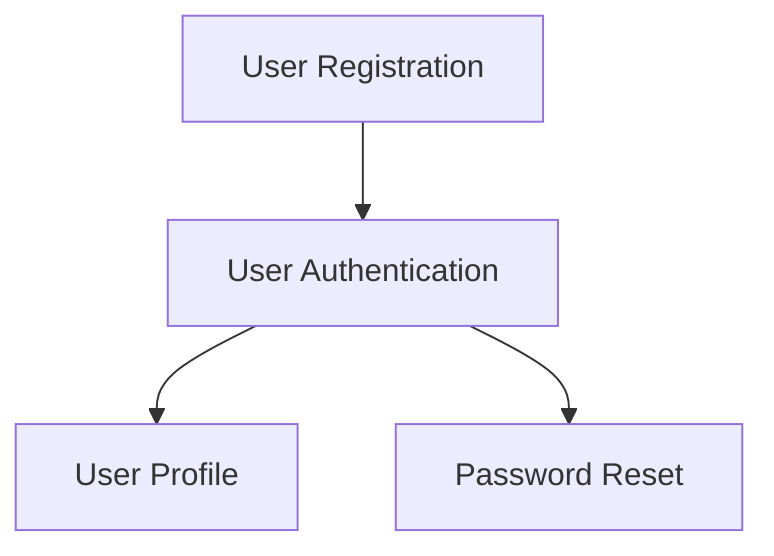

# Skill Specification: PRD Analyzer

**Skill Name**: `prism.analyze-prd`
**Version**: 1.0
**Status**: Specification
**Owner**: MT-PRISM Team

---

## Overview

The PRD Analyzer skill extracts, structures, and analyzes requirements from Product Requirements Documents. It parses PRDs from Confluence or local files, identifies requirements, classifies them, detects ambiguities, and generates a structured requirements document with dependency mapping.

---

## Purpose & Goals

### Primary Goals
1. **Extract Requirements**: Identify all functional and non-functional requirements from PRD
2. **Structure Data**: Convert unstructured PRD into machine-readable format
3. **Classify Requirements**: Categorize by type, priority, complexity
4. **Detect Issues**: Find ambiguities, missing information, inconsistencies
5. **Map Dependencies**: Identify requirement relationships and dependencies

### Success Criteria
- ✅ 95%+ accuracy in requirement extraction (vs. manual review)
- ✅ All requirement categories identified correctly
- ✅ Ambiguities flagged accurately (90%+ precision)
- ✅ Processing time < 2 minutes for typical PRD (5-10 pages)
- ✅ Output format valid and complete

---

## Input Parameters

### Required Parameters

**`--prd-url <url>`** or **`--prd-file <path>`**
- Confluence URL: `https://company.atlassian.net/wiki/spaces/PROD/pages/123456`
- Local file: `./docs/PRD-Feature-X.md` or `.pdf` or `.docx`
- Validation: Must be valid URL or existing file path

### Optional Parameters

**`--template <path>`**
- Path to requirement template for validation
- Default: Built-in template
- Example: `./templates/requirement-template.yaml`

**`--output-dir <path>`**
- Output directory for generated files
- Default: `./.prism/prd-analysis-{timestamp}/`

**`--format <format>`**
- Output format: `yaml` (default), `json`, `markdown`

**`--extract-attachments`**
- Boolean flag to download and analyze PRD attachments
- Default: `false`

**`--confidence-threshold <number>`**
- Minimum confidence score (0.0-1.0) for including requirements
- Default: `0.7`

---

## Processing Steps

### Step 1: Fetch PRD Content

**If Confluence URL**:
```typescript
1. Validate URL format
2. Use MCP Atlassian to fetch page content
   - Method: mcp_atlassian.getConfluencePage(pageId)
3. Download attachments if --extract-attachments flag set
4. Convert Confluence HTML to Markdown
5. Store original HTML for reference
```

**If Local File**:
```typescript
1. Validate file exists and is readable
2. Read file content
3. If PDF: Convert to text using markitdown or similar
4. If DOCX: Extract text and structure
5. If Markdown: Parse directly
```

### Step 2: Parse PRD Structure

```typescript
1. Identify document sections:
   - Title and overview
   - Goals and objectives
   - User stories
   - Functional requirements
   - Non-functional requirements
   - Acceptance criteria
   - Out of scope
   - Stakeholders
   - Timeline and milestones

2. Extract metadata:
   - Author, date, version
   - Project name
   - Status (draft, approved, etc.)
```

### Step 3: Extract Requirements

**For Each Section**:
```typescript
1. Use Claude to identify requirement statements:
   - Look for: "must", "should", "shall", "will"
   - Numbered/bulleted lists of capabilities
   - User story format: "As a [role], I want [feature] so that [benefit]"

2. Extract requirement details:
   - Description
   - Type (functional/non-functional)
   - Priority (explicit or inferred)
   - Acceptance criteria
   - Related user stories
   - Dependencies (mentioned in text)

3. Generate unique requirement ID:
   - Format: REQ-{section}-{number}
   - Example: REQ-FUNC-001, REQ-PERF-005
```

### Step 4: Classify Requirements

**Classification Taxonomy**:
```yaml
Type:
  - functional          # What the system does
  - non-functional      # How the system performs
  - constraint          # Limitations or restrictions
  - assumption          # Stated assumptions

Priority:
  - critical            # Must have for MVP
  - high                # Very important
  - medium              # Important but not blocking
  - low                 # Nice to have

Category:
  - feature             # New capability
  - enhancement         # Improvement to existing
  - bug-fix             # Fixing existing issue
  - technical-debt      # Code quality improvement
  - performance         # Performance optimization
  - security            # Security-related
  - compliance          # Regulatory requirement

Complexity:
  - 1-3: Simple         # Straightforward implementation
  - 4-5: Medium         # Some complexity
  - 6-8: Complex        # Significant effort
  - 9-10: Very Complex  # High uncertainty/risk

Status:
  - draft               # Not yet reviewed
  - validated           # Reviewed and approved
  - clarified           # Clarifications added
  - approved            # Final approval
```

### Step 5: Detect Issues and Ambiguities

**Ambiguity Detection**:
```typescript
1. Vague language:
   - "Should be fast", "user-friendly", "intuitive"
   - Flag: No specific metrics or criteria

2. Missing information:
   - No acceptance criteria
   - No priority specified
   - No owner assigned

3. Inconsistencies:
   - Conflicting requirements
   - Duplicate requirements (semantic similarity)

4. Incomplete user stories:
   - Missing role, feature, or benefit
   - No clear actor

5. Technical ambiguities:
   - "Integrate with system X" (no details)
   - "Support multiple formats" (which ones?)
```

**Output for Each Issue**:
```yaml
issue:
  type: ambiguity | missing | conflict | incomplete
  severity: critical | high | medium | low
  requirement_id: REQ-FUNC-003
  description: "No specific performance metric for 'fast loading'"
  suggestion: "Define target page load time (e.g., < 2 seconds)"
  location: "Section 3, paragraph 2"
```

### Step 6: Build Dependency Graph

```typescript
1. Explicit dependencies:
   - "Requirement A depends on B"
   - "Must be implemented after X"

2. Implicit dependencies:
   - Authentication required for user profile
   - Database schema needed before CRUD operations

3. Generate graph structure:
   nodes: requirements
   edges: dependencies (with type: blocks, depends-on, related-to)

4. Detect circular dependencies (error if found)

5. Calculate implementation order (topological sort)
```

### Step 7: Generate Outputs

**Primary Output**: `requirements.yaml`
```yaml
metadata:
  prd_source: "Confluence Page ID 123456"
  analyzed_at: "2025-11-05T10:30:00Z"
  analyzer_version: "1.0"
  total_requirements: 23

requirements:
  - id: REQ-FUNC-001
    type: functional
    category: feature
    priority: critical
    complexity: 5
    title: "User Authentication"
    description: "Users must be able to log in using email and password"
    acceptance_criteria:
      - "Login form with email and password fields"
      - "Remember me checkbox"
      - "Forgot password link"
      - "Successful login redirects to dashboard"
      - "Failed login shows error message"
    user_stories:
      - "As a user, I want to log in so that I can access my account"
    dependencies:
      - REQ-FUNC-002  # User registration
    source_location: "Section 3.1, User Authentication"
    confidence: 0.95
    status: draft
    issues: []

  - id: REQ-PERF-001
    type: non-functional
    category: performance
    priority: high
    complexity: 6
    title: "Page Load Performance"
    description: "All pages must load within 2 seconds"
    acceptance_criteria:
      - "Time to First Byte (TTFB) < 500ms"
      - "First Contentful Paint (FCP) < 1.5s"
      - "Time to Interactive (TTI) < 2s"
    dependencies: []
    source_location: "Section 5, Performance Requirements"
    confidence: 0.92
    status: draft
    issues: []

  # ... more requirements
```

**Secondary Output**: `requirements-graph.mmd`


**Tertiary Output**: `prd-analysis-report.md`
```markdown
# PRD Analysis Report

**PRD Source**: Confluence Page 123456
**Analyzed**: 2025-11-05 10:30 AM
**Analysis Duration**: 1m 45s

## Summary

- **Total Requirements**: 23
  - Functional: 18
  - Non-functional: 5
- **Priority Breakdown**:
  - Critical: 5
  - High: 10
  - Medium: 6
  - Low: 2
- **Complexity**:
  - Average: 5.2
  - Highest: REQ-FUNC-015 (Complexity: 9)

## Issues Found

### Critical Issues (2)
1. **REQ-FUNC-007**: Missing acceptance criteria
2. **REQ-PERF-002**: Vague performance requirement ("should be fast")

### High Priority Issues (5)
1. **REQ-FUNC-003**: Depends on undefined requirement
2. **REQ-FUNC-011**: Conflicting with REQ-FUNC-012
...

## Recommendations

1. **Define missing acceptance criteria** for 3 requirements
2. **Clarify vague requirements** (4 found)
3. **Resolve conflicts** between REQ-FUNC-011 and REQ-FUNC-012
4. **Add technical details** for integration requirements

## Next Steps

1. Review and address all critical issues
2. Run `/prism.analyze-figma` to analyze designs
3. Run `/prism.validate` to cross-check requirements vs. designs
```

---

## Prompt Engineering Guidelines

### Main Prompt Structure

```markdown
# Role and Context
You are a senior product analyst specializing in requirement extraction and analysis.
Your task is to analyze a PRD and extract structured, actionable requirements.

# Input
[PRD content will be provided here]

# Your Task
1. Read the entire PRD carefully
2. Identify all requirements (both functional and non-functional)
3. For each requirement, extract:
   - Clear description
   - Type and category
   - Priority (if stated or reasonably inferred)
   - Acceptance criteria
   - Dependencies
4. Detect any ambiguities, missing information, or conflicts
5. Generate structured output in YAML format

# Output Format
[Provide YAML schema]

# Classification Guidelines
[Provide classification rules]

# Quality Checklist
- [ ] All requirements have unique IDs
- [ ] Each requirement has clear description
- [ ] Acceptance criteria are specific and testable
- [ ] Dependencies are identified
- [ ] Ambiguities are flagged
- [ ] No duplicate requirements
```

### Few-Shot Examples

**Include 2-3 examples in the prompt**:

```markdown
## Example 1: User Authentication Requirement

Input Text:
"Users should be able to sign in to their account using their email address and
password. The system must remember their login for 30 days if they check the
'Remember Me' option."

Expected Output:
```yaml
- id: REQ-FUNC-001
  type: functional
  category: feature
  priority: critical
  complexity: 4
  title: "User Authentication with Email/Password"
  description: "Users can sign in using email and password with optional remember me"
  acceptance_criteria:
    - "Login form with email and password fields"
    - "Remember me checkbox that persists login for 30 days"
    - "Successful authentication redirects to dashboard"
    - "Invalid credentials show clear error message"
  dependencies: []
  issues: []
```

## Example 2: Vague Requirement (with issues)

Input Text:
"The application should be fast and responsive."

Expected Output:
```yaml
- id: REQ-PERF-001
  type: non-functional
  category: performance
  priority: high
  complexity: 3
  title: "Application Performance"
  description: "The application should be fast and responsive"
  acceptance_criteria: []
  dependencies: []
  issues:
    - type: ambiguity
      severity: high
      description: "Vague performance requirement lacks specific metrics"
      suggestion: "Define specific metrics: page load time, API response time, etc."
```
```

---

## Edge Cases & Error Handling

### Edge Cases

1. **Empty or minimal PRD**:
   - Warn user that PRD appears incomplete
   - Extract what's available
   - Flag missing sections

2. **Non-standard PRD format**:
   - Attempt to parse with flexible logic
   - Use Claude's understanding of context
   - May produce lower confidence scores

3. **Very long PRD (> 50 pages)**:
   - Process in chunks
   - Combine results
   - Show progress updates

4. **Multiple languages**:
   - Detect language
   - Process in original language
   - Note if non-English in output

5. **Attachments with additional requirements**:
   - Parse attachments if flag set
   - Cross-reference with main document
   - Note source of each requirement

### Error Handling

```typescript
Error Scenarios:

1. Confluence page not found (404):
   - Error message: "Cannot access Confluence page. Check URL and permissions."
   - Suggest: Verify URL, check MCP configuration

2. File not found:
   - Error message: "File not found at path: {path}"
   - Suggest: Check file path, ensure file exists

3. Invalid format:
   - Error message: "Unable to parse PRD format"
   - Suggest: Supported formats: .md, .pdf, .docx, Confluence HTML

4. MCP connection error:
   - Error message: "Cannot connect to Confluence MCP"
   - Suggest: Check MCP server status, verify credentials

5. Claude API error:
   - Retry with exponential backoff (3 attempts)
   - If fails: Save partial results, report error
```

---

## Testing Criteria

### Test Cases

**Test 1: Standard PRD with Clear Requirements**
```
Input: Well-structured PRD with 15 requirements
Expected:
  - All 15 requirements extracted
  - Correct classification (functional/non-functional)
  - Reasonable priority inference
  - No false ambiguity flags
  - Dependency graph accurate
```

**Test 2: PRD with Ambiguous Requirements**
```
Input: PRD with vague language ("fast", "user-friendly", "scalable")
Expected:
  - Requirements extracted
  - Ambiguities flagged with severity
  - Suggestions for clarification provided
```

**Test 3: PRD with Dependencies**
```
Input: PRD with explicit dependencies ("requires Feature A")
Expected:
  - Dependencies correctly identified
  - Dependency graph shows relationships
  - Implementation order suggested
```

**Test 4: Minimal/Incomplete PRD**
```
Input: Short PRD (1 page) with missing sections
Expected:
  - Extract available requirements
  - Flag missing sections (acceptance criteria, priorities)
  - Warn user about incompleteness
```

**Test 5: Large PRD (30+ pages)**
```
Input: Comprehensive PRD with 50+ requirements
Expected:
  - All requirements extracted
  - Processing completes in < 5 minutes
  - No performance degradation
  - Memory usage acceptable
```

### Acceptance Criteria for Skill

- [ ] Successfully analyzes 10 real PRDs with 95%+ accuracy
- [ ] Processing time < 2 min for typical PRD (5-10 pages)
- [ ] Output format valid (YAML schema validation passes)
- [ ] Ambiguity detection precision > 90% (verified manually)
- [ ] Dependency graph accurate (no missing edges)
- [ ] Handles all edge cases gracefully
- [ ] Error messages clear and actionable
- [ ] Documentation complete with examples

---

## Integration Points

### Required MCPs
- **@modelcontextprotocol/server-atlassian**: For Confluence access
- Optional: **markitdown MCP**: For PDF conversion

### Claude Code Tools Used
- **Read**: For local files
- **Write**: For output files
- **WebFetch**: For Confluence pages (fallback)

### Output Files Location
```
.prism/prd-analysis-{timestamp}/
├── requirements.yaml           # Primary structured output
├── requirements-graph.mmd      # Mermaid dependency diagram
├── prd-analysis-report.md      # Human-readable summary
├── original-prd.md             # Original PRD content
└── metadata.json               # Analysis metadata
```

---

## Performance Requirements

- **Processing Time**: < 2 min for typical PRD (5-10 pages)
- **Accuracy**: 95%+ requirement extraction accuracy
- **Memory Usage**: < 500 MB for large PRDs
- **Claude API Calls**: Optimize to 2-4 calls per analysis
- **Token Usage**: < 50K tokens for typical PRD

---

## Future Enhancements

**Version 1.1** (Future):
- Multi-language support (Spanish, French, German)
- Video transcript analysis (from demo videos)
- Integration with PRD templates for guided extraction
- Machine learning for improved classification
- Historical PRD comparison (what changed?)

**Version 1.2** (Future):
- Real-time collaboration (analyze draft PRDs)
- Requirement suggestions based on similar projects
- Automatic priority inference from business context
- Integration with product roadmap tools

---

## Examples

### Example Usage 1: Analyze Confluence PRD

```bash
# In Claude Code
> /prism.analyze-prd --prd-url https://company.atlassian.net/wiki/spaces/PROD/pages/123456

Analyzing PRD from Confluence...
✓ Fetched PRD content (1.2 seconds)
✓ Parsed document structure (8 sections found)
✓ Extracted 23 requirements (18 functional, 5 non-functional)
✓ Classified requirements (5 critical, 10 high, 6 medium, 2 low)
✓ Detected 7 issues (2 critical, 5 high)
✓ Built dependency graph (6 dependencies)
✓ Generated outputs (1m 45s total)

Output files created:
  📄 .prism/prd-analysis-20251105-103000/requirements.yaml
  📊 .prism/prd-analysis-20251105-103000/requirements-graph.mmd
  📋 .prism/prd-analysis-20251105-103000/prd-analysis-report.md

Summary:
  • 23 total requirements
  • 7 issues need attention (2 critical)
  • Average complexity: 5.2/10

Next steps:
  1. Review critical issues in prd-analysis-report.md
  2. Run /prism.analyze-figma to analyze designs
  3. Run /prism.validate to cross-check
```

### Example Usage 2: Analyze Local Markdown File

```bash
> /prism.analyze-prd --prd-file ./docs/PRD-User-Management.md --format json

Analyzing local PRD file...
✓ Read file (134 KB)
✓ Parsed markdown structure
✓ Extracted 15 requirements
✓ Analysis complete (52 seconds)

Output: .prism/prd-analysis-20251105-110000/requirements.json
```

---

## References

- [CLAUDE.md](../../CLAUDE.md) - Project overview
- [PLUGIN_PROPOSAL.md](../planning/PLUGIN_PROPOSAL.md) - Overall plugin architecture
- [Requirement Template](../../templates/requirement.yaml) - YAML schema
- [MCP Atlassian Docs](https://github.com/modelcontextprotocol/servers/tree/main/atlassian)

---

**Document Owner**: MT-PRISM Team
**Last Updated**: 2025-11-05
**Next Review**: After implementation
