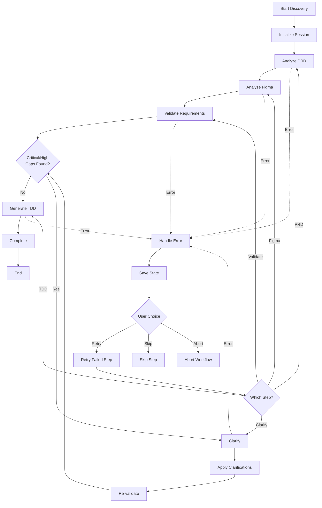

# Workflow Specification: Full Discovery

**Workflow Name**: `prism.discover`
**Version**: 1.0
**Status**: Specification
**Owner**: MT-PRISM Team

---

## Overview

The Full Discovery Workflow orchestrates all MT-PRISM skills to execute the complete PRD-to-TDD process end-to-end. It coordinates PRD analysis, Figma analysis, validation, clarification loops, and TDD generation with appropriate error handling and user feedback.

---

## Purpose & Goals

### Primary Goals
1. **End-to-End Automation**: Execute full discovery process with single command
2. **Orchestration**: Coordinate all skills in correct sequence
3. **Error Recovery**: Handle failures gracefully and allow resume
4. **Progress Tracking**: Provide real-time status updates to user
5. **Iterative Refinement**: Support clarification loops until validation passes

### Success Criteria
- ✅ Complete PRD-to-TDD in one command (minimal user interaction)
- ✅ Handle errors without losing progress
- ✅ Provide clear progress updates
- ✅ Support interactive clarifications
- ✅ Produce validated, complete TDD
- ✅ Total execution time < 15 minutes (excluding clarification wait time)

---

## Input Parameters

### Required Parameters

**`--prd-url <url>` or `--prd-file <path>`**
- Confluence URL or local PRD file
- Example: `https://company.atlassian.net/wiki/spaces/PROD/pages/123456`

**`--figma-url <url>` or `--figma-file-id <id>`**
- Figma file URL or ID
- Example: `https://figma.com/file/abc123/ProjectName`

### Optional Parameters

**`--config <path>`**
- Configuration file with all settings
- Example: `.prism-config.yaml`
- Default: Look for `.prism-config.yaml` in current directory

**`--codebase <path>`**
- Path to existing codebase
- Example: `./src`
- Default: None

**`--clarification-mode <mode>`**
- Mode for clarifications: `interactive`, `jira`, `slack`, `skip`
- Default: `interactive`

**`--skip-clarification`**
- Boolean: Skip clarification step even if gaps found
- Default: `false`
- Warning: May produce incomplete TDD

**`--auto-approve`**
- Boolean: Auto-approve validation if only low-priority gaps
- Default: `false`

**`--output-dir <path>`**
- Base output directory
- Default: `./.prism/`

**`--resume <session-id>`**
- Resume from previous failed/interrupted session
- Example: `--resume sess-20251105-154500`

---

## Workflow Steps

### Overall Flow



### Step 0: Initialize Session

```typescript
1. Create session ID:
   session_id = `sess-${timestamp}`

2. Create session directory:
   .prism/sessions/sess-20251105-154500/

3. Initialize session state:
   session_state.yaml:
     session_id: sess-20251105-154500
     created_at: 2025-11-05T15:45:00Z
     status: in_progress
     current_step: 1_prd_analysis
     steps:
       - id: 1_prd_analysis
         status: pending
       - id: 2_figma_analysis
         status: pending
       - id: 3_validation
         status: pending
       - id: 4_clarification
         status: pending
       - id: 5_tdd_generation
         status: pending

4. Load configuration:
   - From --config file
   - Or use defaults
   - Validate all required parameters

5. Display welcome message:
   ━━━━━━━━━━━━━━━━━━━━━━━━━━━━━━━━━━━━━━
   MT-PRISM Discovery Workflow
   Session: sess-20251105-154500
   ━━━━━━━━━━━━━━━━━━━━━━━━━━━━━━━━━━━━━━

   Configuration:
     • PRD: Confluence page 123456
     • Figma: https://figma.com/file/abc123
     • Codebase: ./src
     • Clarification mode: interactive

   Estimated time: 10-15 minutes

   Starting discovery...
```

### Step 1: Analyze PRD

```typescript
1. Update session state:
   current_step: 1_prd_analysis
   steps[0].status: in_progress
   steps[0].started_at: 2025-11-05T15:45:05Z

2. Display progress:
   [1/5] Analyzing PRD from Confluence...

3. Execute PRD analysis:
   result = execute_skill('prism.analyze-prd', {
     prd_url: params.prd_url,
     output_dir: `${session_dir}/01-prd-analysis/`
   })

4. Handle result:
   If success:
     - Update session state: steps[0].status = completed
     - Store output paths
     - Display summary:
       ✓ PRD analyzed (1m 45s)
         • 23 requirements extracted
         • 2 critical issues found
         • Output: .prism/sessions/sess-.../01-prd-analysis/

   If error:
     - Update session state: steps[0].status = failed
     - Save error details
     - Jump to error handler

5. Save checkpoint:
   session_state.yaml updated with results
```

### Step 2: Analyze Figma

```typescript
1. Update session state:
   current_step: 2_figma_analysis
   steps[1].status: in_progress

2. Display progress:
   [2/5] Analyzing Figma designs...

3. Execute Figma analysis:
   result = execute_skill('prism.analyze-figma', {
     figma_url: params.figma_url,
     output_dir: `${session_dir}/02-figma-analysis/`
   })

4. Handle result:
   If success:
     ✓ Figma analyzed (2m 15s)
       • 42 components extracted
       • 5 UI patterns identified
       • Output: .prism/sessions/sess-.../02-figma-analysis/

   If error:
     - Save state and handle error

5. Save checkpoint
```

### Step 3: Validate Requirements

```typescript
1. Update session state:
   current_step: 3_validation
   steps[2].status: in_progress

2. Display progress:
   [3/5] Validating requirements against designs...

3. Execute validation:
   result = execute_skill('prism.validate', {
     requirements: `${session_dir}/01-prd-analysis/requirements.yaml`,
     components: `${session_dir}/02-figma-analysis/components.yaml`,
     codebase: params.codebase,
     output_dir: `${session_dir}/03-validation/`
   })

4. Handle result:
   If success:
     ✓ Validation complete (1m 52s)
       • 18 complete mappings (78%)
       • 3 partial mappings (13%)
       • 2 missing UI (9%)
       • 10 gaps found (2 critical, 5 high, 3 medium)

5. Check validation status:
   status = result.validation_status

   If status == "VALIDATED":
     - No critical or high gaps
     - Skip clarification step
     - Proceed to TDD generation

   If status == "NEEDS_CLARIFICATION":
     - Check gap severity
     - Proceed to clarification step

   If status == "FAILED":
     - Critical gaps + unable to proceed
     - Handle error

6. Save checkpoint
```

### Step 4: Clarification Loop

```typescript
This step may iterate multiple times until validation passes.

Iteration 1:
  1. Update session state:
     current_step: 4_clarification
     steps[3].status: in_progress
     steps[3].iteration: 1

  2. Display progress:
     [4/5] Managing clarifications (Attempt 1)...

     Validation found 10 gaps (2 critical, 5 high, 3 medium)
     Need clarification before proceeding.

  3. Check clarification mode:

     If mode == "skip":
       ⚠️  Skipping clarification (--skip-clarification flag)
       Warning: TDD may be incomplete
       Proceed to TDD generation

     If mode == "interactive":
       Display: "Ready to enter interactive clarification? (Y/n)"
       If user confirms: proceed with interactive
       If user declines: offer alternatives (jira, slack, file, skip)

     If mode == "jira" or "slack":
       Execute async clarification
       Display: "Questions sent. Waiting for responses..."
       Wait for timeout or manual trigger to continue

  4. Execute clarification:
     result = execute_skill('prism.clarify', {
       questions: `${session_dir}/03-validation/clarification-questions.md`,
       mode: params.clarification_mode,
       output_dir: `${session_dir}/04-clarification-iter1/`
     })

  5. Handle result:
     If success:
       ✓ Clarifications complete
         • 10/10 questions answered
         • 3 requirements updated
         • 1 new requirement created

  6. Re-validate:
     Display: "Re-validating with clarifications applied..."

     result = execute_skill('prism.validate', {
       requirements: `${session_dir}/04-clarification-iter1/updated-requirements.yaml`,
       components: `${session_dir}/02-figma-analysis/components.yaml`,
       output_dir: `${session_dir}/03-validation-iter2/`
     })

  7. Check new validation status:

     If status == "VALIDATED":
       ✓ Validation passed!
       Proceed to TDD generation

     If status == "NEEDS_CLARIFICATION":
       gaps_remaining = result.gaps.filter(g => g.severity in ['critical', 'high'])

       If gaps_remaining.length > 0:
         Display: "Still have {n} critical/high gaps. Continue clarification? (Y/n)"

         If yes:
           Increment iteration: steps[3].iteration = 2
           Go to Iteration 2

         If no:
           Options:
             A) Proceed with gaps (risky)
             B) Abort workflow
             C) Manual review

  8. Save checkpoint

Maximum iterations: 3
After 3 iterations, force user decision.
```

### Step 5: Generate TDD

```typescript
1. Update session state:
   current_step: 5_tdd_generation
   steps[4].status: in_progress

2. Display progress:
   [5/5] Generating Technical Design Document...

3. Determine which requirements file to use:
   - If clarifications applied: use updated-requirements.yaml
   - Otherwise: use original requirements.yaml

4. Execute TDD generation:
   result = execute_skill('prism.generate-tdd', {
     requirements: requirements_file,
     components: `${session_dir}/02-figma-analysis/components.yaml`,
     codebase: params.codebase,
     output_dir: `${session_dir}/05-tdd/`,
     create_tasks: true,
     task_platform: config.task_platform
   })

5. Handle result:
   If success:
     ✓ TDD generated (3m 45s)
       • 45-page comprehensive TDD
       • 32 API endpoints
       • 8 database tables
       • 78 implementation tasks
       • Estimated: 8-10 weeks

   If error:
     - Save state and handle error

6. Save checkpoint
```

### Step 6: Complete Workflow

```typescript
1. Update session state:
   status: completed
   completed_at: 2025-11-05T16:02:00Z
   total_duration: 17m 0s

2. Generate summary report:
   discovery-summary.md:
     # Discovery Summary

     **Session**: sess-20251105-154500
     **Duration**: 17 minutes
     **Status**: ✅ Completed

     ## Timeline
     - PRD Analysis: 1m 45s
     - Figma Analysis: 2m 15s
     - Validation: 1m 52s
     - Clarification: 8m 30s (interactive, 10 questions)
     - Re-validation: 1m 15s
     - TDD Generation: 3m 45s

     ## Results
     - Requirements: 23 (all validated)
     - UI Components: 42
     - API Endpoints: 32
     - Database Tables: 8
     - Implementation Tasks: 78
     - Estimated Effort: 89 story points (8-10 weeks)

     ## Output Files
     1. PRD Analysis: .prism/sessions/sess-.../01-prd-analysis/
     2. Figma Analysis: .prism/sessions/sess-.../02-figma-analysis/
     3. Validation: .prism/sessions/sess-.../03-validation/
     4. Clarifications: .prism/sessions/sess-.../04-clarification-iter1/
     5. TDD: .prism/sessions/sess-.../05-tdd/

     ## Next Steps
     1. Review TDD.md with team
     2. Import tasks to Jira
     3. Set up project repository
     4. Begin Phase 1 implementation

3. Display completion message:
   ━━━━━━━━━━━━━━━━━━━━━━━━━━━━━━━━━━━━━━
   🎉 Discovery Complete!
   ━━━━━━━━━━━━━━━━━━━━━━━━━━━━━━━━━━━━━━

   Total time: 17 minutes

   📄 TDD Generated:
     .prism/sessions/sess-20251105-154500/05-tdd/TDD.md

   📊 Key Deliverables:
     • Technical Design Document (45 pages)
     • API Specification (32 endpoints)
     • Database Schema (8 tables)
     • Task Breakdown (78 tasks, 89 story points)
     • Timeline Estimate: 8-10 weeks

   ✅ Validation: All requirements validated
   ✅ Quality: Ready for implementation

   Next steps:
     1. Review TDD with team
     2. Import tasks: jira import tasks.json
     3. Set up project and start Phase 1

   Session saved: .prism/sessions/sess-20251105-154500/
```

### Error Handling

```typescript
When any step fails:

1. Save current state immediately

2. Display error:
   ❌ Error in [Step Name]

   Error: [Error message]

   Current progress saved.

3. Present options:
   What would you like to do?
     A) Retry this step
     B) Skip this step (may affect quality)
     C) Edit inputs and retry
     D) Abort workflow
     E) View error details

4. Handle choice:

   A) Retry:
     - Re-execute failed step
     - Keep all previous progress

   B) Skip:
     - Mark step as skipped
     - Continue to next step
     - Warn about implications

   C) Edit inputs:
     - Allow user to modify parameters
     - Retry with new inputs

   D) Abort:
     - Save all progress
     - Display resume command:
       To resume: /prism.discover --resume sess-20251105-154500

   E) View details:
     - Show full error stack trace
     - Show logs
     - Return to options menu

5. Common error scenarios:

   PRD fetch failed (404):
     - Verify URL
     - Check MCP configuration
     - Offer to use local file instead

   Figma fetch failed:
     - Verify URL/ID
     - Check Figma MCP configuration
     - Offer to skip Figma analysis

   Validation failed (critical error):
     - Show error details
     - Offer to skip validation (dangerous)

   Claude API error:
     - Retry with backoff
     - Show token usage if rate limit
     - Suggest waiting or switching API key

   Out of memory:
     - Suggest processing in smaller chunks
     - Reduce concurrency
```

### Resume Functionality

```typescript
When --resume flag provided:

1. Load session state:
   session_state = load(`sessions/${session_id}/session_state.yaml`)

2. Validate session:
   If not found:
     Error: "Session not found: {session_id}"
     List available sessions

   If already completed:
     Display: "Session already completed. View results?"

3. Find last completed step:
   last_completed = find_last_completed_step(session_state)

4. Display resume info:
   Resuming session: sess-20251105-154500

   Progress:
     ✓ PRD Analysis (completed)
     ✓ Figma Analysis (completed)
     ✗ Validation (failed)
     ○ Clarification (pending)
     ○ TDD Generation (pending)

   Will resume from: Validation

   Continue? (Y/n)

5. Resume from next step:
   - Skip completed steps
   - Re-execute failed step or start from next pending
   - Continue workflow normally
```

---

## Configuration File Format

`.prism-config.yaml`:
```yaml
# MT-PRISM Configuration
version: 1.0

# MCP Configuration
mcps:
  confluence:
    server: https://company.atlassian.net
    space: PROD
  figma:
    team_id: your-team-id
  jira:
    project: ENG
  slack:
    channels:
      product: "#product-questions"
      design: "#design-questions"
      engineering: "#eng-questions"

# Workflow Settings
workflow:
  clarification_mode: interactive  # interactive | jira | slack | skip
  auto_approve_low_priority_gaps: false
  max_clarification_iterations: 3
  clarification_timeout_days: 3

# TDD Settings
tdd:
  architecture: auto  # auto | monolith | microservices | hybrid
  tech_stack: nextjs  # nextjs | mern | django | rails | custom
  create_tasks: true
  task_platform: jira  # jira | github | linear | generic

# Output Settings
output:
  base_directory: .prism
  keep_sessions: 10  # Number of sessions to keep
  generate_summary: true
```

---

## Example Usage

### Basic Usage

```bash
> /prism.discover \
    --prd-url https://company.atlassian.net/wiki/spaces/PROD/pages/123456 \
    --figma-url https://figma.com/file/abc123/ProjectX

━━━━━━━━━━━━━━━━━━━━━━━━━━━━━━━━━━━━━━
MT-PRISM Discovery Workflow
Session: sess-20251105-154500
━━━━━━━━━━━━━━━━━━━━━━━━━━━━━━━━━━━━━━

Configuration:
  • PRD: Confluence page 123456
  • Figma: https://figma.com/file/abc123
  • Clarification mode: interactive
  • Tech stack: Auto-detect

Estimated time: 10-15 minutes

Starting discovery...

[1/5] Analyzing PRD from Confluence...
✓ PRD analyzed (1m 45s)
  • 23 requirements extracted (18 functional, 5 non-functional)
  • 2 critical issues flagged
  • Output: .prism/sessions/sess-20251105-154500/01-prd-analysis/

[2/5] Analyzing Figma designs...
✓ Figma analyzed (2m 15s)
  • 42 components extracted
  • 5 UI patterns identified (forms, tables, modals, navigation, cards)
  • Output: .prism/sessions/sess-20251105-154500/02-figma-analysis/

[3/5] Validating requirements against designs...
✓ Validation complete (1m 52s)
  • 18 complete mappings (78%)
  • 3 partial mappings (13%)
  • 2 missing UI (9%)
  • 10 gaps found (2 critical, 5 high, 3 medium)
  • Status: NEEDS CLARIFICATION

[4/5] Managing clarifications...

Validation found gaps that need clarification:
  • 2 critical issues
  • 5 high priority issues
  • 3 medium priority issues

Entering interactive clarification mode...

[Clarification Q&A session - 10 questions answered]

✓ Clarifications complete (8m 30s)
  • 10/10 questions answered
  • 3 requirements updated
  • 1 new requirement created

Re-validating with clarifications applied...

✓ Re-validation complete (1m 15s)
  • Gaps reduced: 10 → 3 (all low priority)
  • Status: VALIDATED ✅

[5/5] Generating Technical Design Document...

✓ TDD generated (3m 45s)
  • 45-page comprehensive TDD
  • 32 API endpoints
  • 8 database tables
  • 78 implementation tasks
  • Estimated: 8-10 weeks (team of 5)

━━━━━━━━━━━━━━━━━━━━━━━━━━━━━━━━━━━━━━
🎉 Discovery Complete!
━━━━━━━━━━━━━━━━━━━━━━━━━━━━━━━━━━━━━━

Total time: 17 minutes

📄 Main Output:
  .prism/sessions/sess-20251105-154500/05-tdd/TDD.md

📊 All Deliverables:
  • TDD.md (45 pages)
  • api-spec.yaml (32 endpoints)
  • database-schema.sql (8 tables)
  • tasks.json (78 tasks)
  • types.ts (TypeScript interfaces)
  • discovery-summary.md

Next steps:
  1. Review TDD with team
  2. Import tasks: jira import tasks.json
  3. Set up project and start development

Session: sess-20251105-154500
```

### With Configuration File

```bash
> /prism.discover \
    --config .prism-config.yaml \
    --prd-url https://company.atlassian.net/wiki/spaces/PROD/pages/123456 \
    --figma-url https://figma.com/file/abc123/ProjectX \
    --codebase ./src

# Uses all settings from .prism-config.yaml
```

### Resume Failed Session

```bash
> /prism.discover --resume sess-20251105-154500

Resuming session: sess-20251105-154500

Progress:
  ✓ PRD Analysis (completed 1m 45s)
  ✓ Figma Analysis (completed 2m 15s)
  ✗ Validation (failed)
  ○ Clarification (pending)
  ○ TDD Generation (pending)

Will resume from: Validation

Continue? (Y/n): Y

[Continues from validation step...]
```

---

## Testing Criteria

**Test 1: Happy Path (No Gaps)**
```
Input: Well-matched PRD and Figma
Expected:
  - All 5 steps complete
  - No clarification needed
  - TDD generated
  - Time: < 10 minutes
```

**Test 2: With Clarifications**
```
Input: PRD with gaps vs. Figma
Expected:
  - Clarification step triggered
  - 1-2 iterations
  - Validation passes after clarification
  - TDD generated
  - Time: 15-20 minutes
```

**Test 3: Error Recovery**
```
Input: Invalid Figma URL midway
Expected:
  - Error caught gracefully
  - State saved
  - Resume option provided
  - Can continue after fixing URL
```

**Test 4: Resume Functionality**
```
Input: --resume with partial session
Expected:
  - Loads previous progress
  - Skips completed steps
  - Continues from failure point
```

### Acceptance Criteria

- [ ] Complete end-to-end in single command
- [ ] Handle all error scenarios gracefully
- [ ] Resume from any failure point
- [ ] Clear progress feedback throughout
- [ ] Produce complete, validated TDD
- [ ] Total time < 20 minutes (interactive clarification)

---

## Performance Requirements

- **Total Time**: < 20 min (with interactive clarification)
- **Without Clarification**: < 10 min
- **Resume Overhead**: < 30 seconds
- **Error Recovery**: Immediate (no re-processing)

---

**Document Owner**: MT-PRISM Team
**Last Updated**: 2025-11-05
