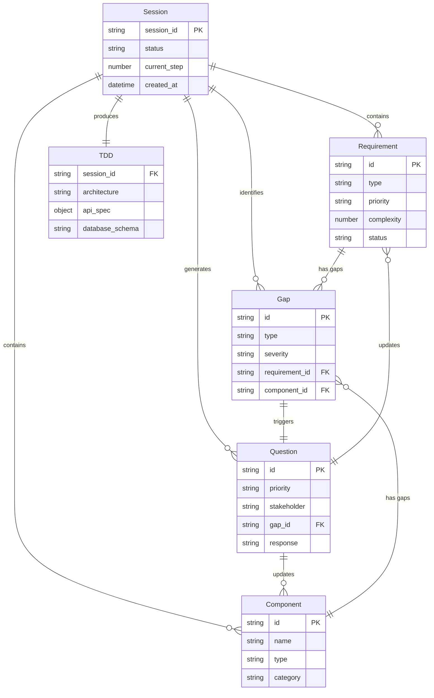
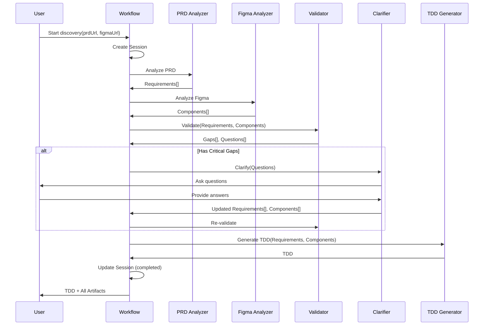

# Data Model: MT-PRISM Claude Code Plugin

**Feature**: 001-prism-plugin  
**Date**: 2025-11-06  
**Status**: Phase 1 Design

## Overview

This document defines the 6 core entities that power the MT-PRISM discovery workflow. Each entity represents a key data structure that flows through the system, from PRD analysis through TDD generation.

## Entity Relationship Diagram



## Entity 1: Requirement

**Purpose**: Represents a single functional or non-functional requirement extracted from PRD

**Source**: Generated by PRD Analyzer skill

**Lifecycle**: draft → validated → clarified → approved

### Schema

```typescript
interface Requirement {
  // Identity
  id: string;                    // Format: REQ-{TYPE}-{NUM} (e.g., REQ-FUNC-001)
  
  // Classification
  type: 'functional' | 'non-functional' | 'constraint' | 'assumption';
  category: 'feature' | 'enhancement' | 'bug-fix' | 'technical-debt' | 
            'performance' | 'security' | 'compliance';
  priority: 'critical' | 'high' | 'medium' | 'low';
  complexity: number;            // 1-10 scale
  
  // Content
  title: string;                 // Short, descriptive (< 100 chars)
  description: string;           // Full requirement description
  acceptance_criteria: string[]; // Testable conditions
  user_stories: string[];        // Related user stories
  
  // Relationships
  dependencies: string[];        // Other requirement IDs
  
  // Metadata
  source_location: string;       // Where in PRD (e.g., "Section 3.1")
  confidence: number;            // 0.0-1.0 extraction confidence
  status: 'draft' | 'validated' | 'clarified' | 'approved';
  
  // Quality
  issues: Issue[];               // Detected problems
}

interface Issue {
  type: 'ambiguity' | 'missing' | 'conflict' | 'incomplete';
  severity: 'critical' | 'high' | 'medium' | 'low';
  description: string;           // What's wrong
  suggestion: string;            // How to fix
}
```

### Validation Rules

- **ID Format**: Must match regex `/^REQ-(FUNC|NF|CONST|ASSUMP)-\d{3}$/`
- **Title**: 1-100 characters, no newlines
- **Complexity**: Integer between 1 and 10
- **Confidence**: Float between 0.0 and 1.0
- **Dependencies**: All referenced IDs must exist in requirements collection
- **Status Transitions**: draft → validated → clarified → approved (one-way)

### Example

```yaml
id: REQ-FUNC-001
type: functional
category: feature
priority: critical
complexity: 4
title: "User Authentication with Email/Password"
description: |
  Users must be able to sign in using email and password.
  The system should support "remember me" functionality to persist
  login sessions for 30 days.
acceptance_criteria:
  - Login form with email and password fields
  - Remember me checkbox that persists login for 30 days
  - Successful authentication redirects to dashboard
  - Invalid credentials show clear error message
  - Account lockout after 5 failed attempts
user_stories:
  - "As a user, I want to log in with my email and password so that I can access my account"
dependencies: []
source_location: "Section 3.1: User Authentication"
confidence: 0.95
status: draft
issues: []
```

### Usage Patterns

```typescript
// Load requirements from file
const requirements = await loadRequirements('./requirements.yaml');

// Filter by type
const functionalReqs = requirements.filter(r => r.type === 'functional');

// Find high-priority with issues
const problematic = requirements.filter(r => 
  r.priority === 'high' && r.issues.length > 0
);

// Build dependency graph
const graph = buildDependencyGraph(requirements);
```

---

## Entity 2: Component

**Purpose**: Represents a UI component extracted from Figma designs

**Source**: Generated by Figma Analyzer skill

**Lifecycle**: extracted → mapped → validated

### Schema

```typescript
interface Component {
  // Identity
  id: string;                    // Format: COMP-{NUM} (e.g., COMP-001)
  name: string;                  // Full component name from Figma
  
  // Classification
  type: string;                  // Button | Input | Card | Modal, etc.
  category: 'atom' | 'molecule' | 'organism' | 'template' | 'page';
  description: string;           // Component description
  
  // Variants
  variants: Variant[];           // All component variants
  
  // Configuration
  properties: Property[];        // Configurable properties
  
  // Structure
  composition: CompositionElement[];  // Child elements
  
  // Usage
  usage: {
    screens: string[];           // Where component appears
    count: number;               // Total instance count
  };
  
  // Design
  design_tokens: {
    color?: string;              // Token reference
    spacing?: string;
    borderRadius?: string;
    typography?: string;
  };
  
  // Assets
  screenshot?: string;           // Path to screenshot file
}

interface Variant {
  name: string;                  // e.g., "default", "hover", "disabled"
  properties: {
    width?: string;
    height?: string;
    backgroundColor?: string;
    color?: string;
    [key: string]: any;
  };
}

interface Property {
  name: string;                  // e.g., "label", "size"
  type: 'text' | 'boolean' | 'enum';
  default: any;                  // Default value
  options?: string[];            // For enum type
}

interface CompositionElement {
  type: string;                  // Element type
  role: string;                  // Role (e.g., "label", "icon")
  optional: boolean;             // Whether optional
}
```

### Validation Rules

- **ID Format**: Must match regex `/^COMP-\d{3}$/`
- **Name**: 1-200 characters
- **Category**: Must be one of atomic design levels
- **Variants**: At least one variant required
- **Usage Count**: Non-negative integer
- **Screenshot Path**: If provided, must be relative path within session directory

### Example

```yaml
id: COMP-001
name: "Button/Primary/Large"
type: Button
category: atom
description: "Primary call-to-action button in large size"
variants:
  - name: default
    properties:
      width: "200px"
      height: "48px"
      backgroundColor: "#2196f3"
      color: "#ffffff"
      borderRadius: "8px"
      fontSize: "16px"
  - name: hover
    properties:
      backgroundColor: "#1976d2"
  - name: disabled
    properties:
      backgroundColor: "#e0e0e0"
      color: "#9e9e9e"
properties:
  - name: label
    type: text
    default: "Button"
  - name: hasIcon
    type: boolean
    default: false
  - name: iconPosition
    type: enum
    default: "left"
    options: ["left", "right"]
composition:
  - type: icon
    role: prefix-icon
    optional: true
  - type: text
    role: label
    optional: false
  - type: icon
    role: suffix-icon
    optional: true
usage:
  screens: ["Login", "Dashboard", "Settings"]
  count: 15
design_tokens:
  color: "colors.primary.500"
  borderRadius: "border-radius.md"
  spacing: "spacing.md"
  typography: "typography.button-large"
screenshot: "screenshots/atoms/Button-Primary-Large.png"
```

### Usage Patterns

```typescript
// Load components from file
const components = await loadComponents('./components.yaml');

// Filter by category
const atoms = components.filter(c => c.category === 'atom');

// Find component by type
const buttons = components.filter(c => c.type === 'Button');

// Get all screens using components
const allScreens = new Set(
  components.flatMap(c => c.usage.screens)
);
```

---

## Entity 3: Gap

**Purpose**: Represents an inconsistency or missing element between requirements and designs

**Source**: Generated by Requirements Validator skill

**Lifecycle**: detected → questioned → resolved

### Schema

```typescript
interface Gap {
  // Identity
  id: string;                    // Format: GAP-{NUM} (e.g., GAP-001)
  
  // Classification
  type: 'missing_ui' | 'no_requirement' | 'incomplete_mapping' | 
        'inconsistency' | 'missing_acceptance_criteria';
  severity: 'critical' | 'high' | 'medium' | 'low';
  
  // References
  requirement_id?: string;       // Related requirement (if applicable)
  component_id?: string;         // Related component (if applicable)
  
  // Details
  description: string;           // What's wrong
  impact: string;                // Why it matters
  
  // Resolution
  stakeholder: string[];         // Who needs to address this
  question_id?: string;          // Related clarification question
  resolved: boolean;             // Whether gap is resolved
  resolution?: string;           // How it was resolved
}
```

### Gap Types

1. **missing_ui**: Requirement exists but no corresponding UI component in Figma
   - Example: PRD specifies CSV export but no export button in designs
   
2. **no_requirement**: UI component exists but no backing requirement in PRD
   - Example: Figma has "Dark Mode Toggle" but not in requirements
   
3. **incomplete_mapping**: Requirement partially implemented in UI
   - Example: PRD specifies 5 form fields but Figma shows only 3
   
4. **inconsistency**: Conflict between PRD description and Figma implementation
   - Example: PRD says "dropdown" but Figma shows "radio buttons"
   
5. **missing_acceptance_criteria**: Requirement lacks testable conditions
   - Example: Requirement "System should be fast" with no specific criteria

### Validation Rules

- **ID Format**: Must match regex `/^GAP-\d{3}$/`
- **Requirement/Component ID**: If provided, must reference valid entity
- **Stakeholder**: Non-empty array
- **Question ID**: If provided, must reference valid question

### Example

```yaml
id: GAP-001
type: missing_ui
severity: critical
requirement_id: REQ-FUNC-015
description: "Requirement specifies CSV export functionality but no export button or menu item found in Figma designs"
impact: "Users will not be able to export data, blocking critical workflow"
stakeholder:
  - design
  - product
question_id: QUEST-001
resolved: false
```

### Usage Patterns

```typescript
// Load gaps from file
const gaps = await loadGaps('./gaps.yaml');

// Filter by severity
const criticalGaps = gaps.filter(g => g.severity === 'critical');

// Group by type
const gapsByType = groupBy(gaps, g => g.type);

// Find unresolved gaps
const unresolved = gaps.filter(g => !g.resolved);

// Get gaps for specific requirement
const reqGaps = gaps.filter(g => g.requirement_id === 'REQ-FUNC-001');
```

---

## Entity 4: Question

**Purpose**: Represents a clarification question needing stakeholder input

**Source**: Generated by Requirements Validator skill, managed by Clarification Manager skill

**Lifecycle**: generated → sent → answered → applied

### Schema

```typescript
interface Question {
  // Identity
  id: string;                    // Format: QUEST-{NUM} (e.g., QUEST-001)
  
  // Classification
  priority: 'critical' | 'high' | 'medium' | 'low';
  stakeholder: 'product' | 'design' | 'engineering' | 'all';
  
  // Content
  question: string;              // The actual question
  context: string;               // Background information
  suggestions: string[];         // Possible answers
  
  // References
  gap_id: string;                // Related gap
  requirement_id?: string;       // Related requirement
  component_id?: string;         // Related component
  
  // Response
  response?: string;             // Stakeholder's answer
  answered_by?: string;          // Who answered
  answered_at?: string;          // ISO8601 timestamp
  confidence?: number;           // 0.0-1.0 confidence in response
  
  // Status
  status: 'pending' | 'answered' | 'applied' | 'deferred';
}
```

### Validation Rules

- **ID Format**: Must match regex `/^QUEST-\d{3}$/`
- **Question**: Non-empty string, ends with question mark
- **Suggestions**: 1-5 suggestions
- **Gap ID**: Must reference valid gap
- **Confidence**: If provided, float between 0.0 and 1.0
- **Status Transitions**: pending → answered → applied (one-way)

### Example

```yaml
id: QUEST-001
priority: critical
stakeholder: design
question: "How should users trigger the CSV export? The requirement specifies export functionality but the design is missing UI for it."
context: |
  REQ-FUNC-015 states: "Users must be able to export table data to CSV format"
  However, the Figma designs for the data table screen (Table View - Desktop) 
  do not include any export button, menu item, or action.
suggestions:
  - "Add an 'Export' button to the table toolbar"
  - "Add 'Export to CSV' option in the row action menu"
  - "Add 'Export' to the main navigation menu"
  - "Defer CSV export to a future release"
gap_id: GAP-001
requirement_id: REQ-FUNC-015
status: pending
```

### Usage Patterns

```typescript
// Load questions from file
const questions = await loadQuestions('./clarification-questions.yaml');

// Group by stakeholder
const productQuestions = questions.filter(q => q.stakeholder === 'product');
const designQuestions = questions.filter(q => q.stakeholder === 'design');

// Get unanswered questions
const pending = questions.filter(q => q.status === 'pending');

// Sort by priority
const sorted = sortByPriority(pending); // critical > high > medium > low

// Get questions for specific gap
const gapQuestions = questions.filter(q => q.gap_id === 'GAP-001');
```

---

## Entity 5: Session

**Purpose**: Represents a workflow execution instance with state and metadata

**Source**: Created by Discovery Workflow at initialization

**Lifecycle**: initialized → running → paused/completed/failed

### Schema

```typescript
interface Session {
  // Identity
  session_id: string;            // Format: sess-{timestamp}
  
  // Type
  workflow_type: 'discovery' | 'prd-only' | 'validation-only';
  
  // Status
  status: 'running' | 'paused' | 'completed' | 'failed';
  current_step: number;          // 1-5
  steps_completed: number[];     // [1, 2, 3]
  
  // Timing
  created_at: string;            // ISO8601
  updated_at: string;            // ISO8601
  started_at?: string;
  completed_at?: string;
  
  // Inputs
  inputs: {
    prd_url?: string;            // Confluence URL or file path
    figma_url?: string;          // Figma file URL
    clarification_mode: 'interactive' | 'jira' | 'slack' | 'file' | 'skip';
    codebase_path?: string;      // Optional for feasibility check
  };
  
  // Outputs
  outputs: {
    requirements_path?: string;
    components_path?: string;
    gaps_path?: string;
    questions_path?: string;
    tdd_path?: string;
  };
  
  // Metrics
  metrics: {
    requirements_extracted?: number;
    components_extracted?: number;
    gaps_found?: number;
    questions_asked?: number;
    duration_ms?: {
      prd_analysis?: number;
      figma_analysis?: number;
      validation?: number;
      clarification?: number;
      tdd_generation?: number;
      total?: number;
    };
  };
  
  // Error (if status = failed)
  error?: {
    step: number;
    message: string;
    stack?: string;
    recoverable: boolean;
  };
}
```

### Validation Rules

- **Session ID Format**: Must match regex `/^sess-\d{13}$/` (timestamp)
- **Current Step**: Integer between 1 and 5
- **Steps Completed**: Sorted array of integers
- **Status Transitions**: running ↔ paused, running → completed/failed
- **Timestamps**: All ISO8601 format
- **Paths**: If provided, must be relative to session directory

### Example

```yaml
session_id: sess-1699123456789
workflow_type: discovery
status: completed
current_step: 5
steps_completed: [1, 2, 3, 4, 5]
created_at: "2025-11-06T10:30:56Z"
updated_at: "2025-11-06T10:48:23Z"
started_at: "2025-11-06T10:30:56Z"
completed_at: "2025-11-06T10:48:23Z"
inputs:
  prd_url: "https://company.atlassian.net/wiki/spaces/PROD/pages/123456"
  figma_url: "https://figma.com/file/abc123/Feature-Designs"
  clarification_mode: interactive
outputs:
  requirements_path: "01-prd-analysis/requirements.yaml"
  components_path: "02-figma-analysis/components.yaml"
  gaps_path: "03-validation/gaps.yaml"
  questions_path: "04-clarification/clarification-questions.md"
  tdd_path: "05-tdd/TDD.md"
metrics:
  requirements_extracted: 24
  components_extracted: 38
  gaps_found: 7
  questions_asked: 5
  duration_ms:
    prd_analysis: 87000       # 1.45 min
    figma_analysis: 142000    # 2.37 min
    validation: 98000         # 1.63 min
    clarification: 420000     # 7 min
    tdd_generation: 267000    # 4.45 min
    total: 1014000            # 16.9 min
```

### Usage Patterns

```typescript
// Create new session
const session = createSession({
  prdUrl: '...',
  figmaUrl: '...',
  clarificationMode: 'interactive'
});

// Load existing session
const session = await loadSession('sess-1699123456789');

// Update session state
await updateSession(session.session_id, {
  current_step: 3,
  steps_completed: [1, 2, 3],
  'outputs.gaps_path': '03-validation/gaps.yaml'
});

// Handle failure
await markSessionFailed(session.session_id, {
  step: 2,
  message: 'Figma MCP connection timeout',
  recoverable: true
});

// Resume from checkpoint
const session = await resumeSession('sess-1699123456789');
```

---

## Entity 6: TDD (Technical Design Document)

**Purpose**: Represents the final comprehensive technical specification

**Source**: Generated by TDD Generator skill

**Lifecycle**: generated → reviewed → approved

### Schema

```typescript
interface TDD {
  // Metadata
  session_id: string;            // Related session
  generated_at: string;          // ISO8601
  version: string;               // Semantic version
  
  // Architecture
  architecture: {
    type: 'monolith' | 'microservices' | 'hybrid';
    rationale: string;
    diagram: string;             // Mermaid diagram
    components: ArchitectureComponent[];
  };
  
  // API Specification
  api_spec: {
    format: 'openapi-3.1';
    spec: object;                // Valid OpenAPI spec object
    endpoints: Endpoint[];       // Simplified endpoint list
  };
  
  // Database
  database: {
    type: 'postgresql' | 'mysql' | 'mongodb' | 'hybrid';
    schema: string;              // Executable SQL DDL
    models: Model[];
    relationships: Relationship[];
  };
  
  // Frontend
  frontend: {
    framework: string;           // React, Vue, Angular, etc.
    architecture: string;        // Component-based, etc.
    components: FrontendComponent[];
    state_management: string;
    routing: string;
  };
  
  // Implementation
  implementation: {
    phases: Phase[];
    tasks: Task[];
    effort_estimate: {
      story_points: number;
      weeks: number;
    };
  };
  
  // Quality
  testing: {
    strategy: string;
    unit_test_coverage: string;
    integration_tests: string[];
    e2e_tests: string[];
  };
  
  // Operations
  deployment: {
    environment: string;
    ci_cd: string;
    monitoring: string;
  };
  
  // Coverage
  requirements_coverage: {
    total: number;
    covered: number;
    uncovered: string[];         // Requirement IDs
  };
}

interface ArchitectureComponent {
  name: string;
  type: 'service' | 'module' | 'library';
  responsibilities: string[];
  dependencies: string[];
}

interface Endpoint {
  method: 'GET' | 'POST' | 'PUT' | 'PATCH' | 'DELETE';
  path: string;
  summary: string;
  requirement_ids: string[];
}

interface Model {
  name: string;
  fields: Field[];
  indexes: string[];
  requirement_ids: string[];
}

interface Field {
  name: string;
  type: string;
  nullable: boolean;
  unique: boolean;
  default?: any;
}

interface Relationship {
  from: string;
  to: string;
  type: 'one-to-one' | 'one-to-many' | 'many-to-many';
  cascade: boolean;
}

interface FrontendComponent {
  name: string;
  type: string;
  figma_component_id: string;
  requirement_ids: string[];
  props: string[];
}

interface Phase {
  number: number;
  name: string;
  description: string;
  duration_weeks: number;
  tasks: string[];              // Task IDs
}

interface Task {
  id: string;                    // TASK-{NUM}
  title: string;
  description: string;
  requirement_ids: string[];
  effort_story_points: number;
  priority: string;
  dependencies: string[];        // Other task IDs
}
```

### Validation Rules

- **Session ID**: Must reference valid session
- **API Spec**: Must be valid OpenAPI 3.1 schema
- **Database Schema**: Must be syntactically valid SQL
- **Requirements Coverage**: total = covered + uncovered.length
- **Task Dependencies**: All referenced task IDs must exist
- **Timestamps**: ISO8601 format

### Example (Simplified)

```yaml
session_id: sess-1699123456789
generated_at: "2025-11-06T10:48:23Z"
version: "1.0.0"

architecture:
  type: hybrid
  rationale: |
    Core business logic remains in monolith for rapid development.
    New API layer deployed as microservice for scalability.
  diagram: |
    graph TB
      Client --> API
      API --> Monolith
      API --> AuthService
  components:
    - name: API Gateway
      type: service
      responsibilities:
        - Request routing
        - Authentication
        - Rate limiting
      dependencies: []

api_spec:
  format: openapi-3.1
  endpoints:
    - method: POST
      path: /auth/login
      summary: "User login with email/password"
      requirement_ids: ["REQ-FUNC-001"]
    - method: GET
      path: /users/{id}
      summary: "Get user profile"
      requirement_ids: ["REQ-FUNC-003"]

database:
  type: postgresql
  schema: |
    CREATE TABLE users (
      id SERIAL PRIMARY KEY,
      email VARCHAR(255) UNIQUE NOT NULL,
      password_hash VARCHAR(255) NOT NULL,
      created_at TIMESTAMP DEFAULT NOW()
    );
  models:
    - name: User
      fields:
        - name: id
          type: integer
          nullable: false
          unique: true
        - name: email
          type: string
          nullable: false
          unique: true
      indexes: ["email"]
      requirement_ids: ["REQ-FUNC-001", "REQ-FUNC-003"]

frontend:
  framework: React
  architecture: Component-based with TypeScript
  components:
    - name: LoginForm
      type: page
      figma_component_id: COMP-012
      requirement_ids: ["REQ-FUNC-001"]
      props: ["onSubmit", "loading", "error"]

implementation:
  phases:
    - number: 1
      name: "Authentication & User Management"
      duration_weeks: 2
      tasks: ["TASK-001", "TASK-002"]
  tasks:
    - id: TASK-001
      title: "Implement user authentication API"
      requirement_ids: ["REQ-FUNC-001"]
      effort_story_points: 5
      priority: critical
      dependencies: []

testing:
  strategy: "Test pyramid with 70% unit, 20% integration, 10% E2E"
  unit_test_coverage: "80% minimum"
  integration_tests:
    - "API authentication flow"
    - "Database CRUD operations"
  e2e_tests:
    - "Complete login workflow"
    - "User profile management"

requirements_coverage:
  total: 24
  covered: 24
  uncovered: []
```

### Usage Patterns

```typescript
// Generate TDD
const tdd = await generateTDD({
  requirements,
  components,
  sessionId: 'sess-1699123456789'
});

// Validate API spec
const isValidOpenAPI = await validateOpenAPISpec(tdd.api_spec.spec);

// Check requirements coverage
const uncovered = tdd.requirements_coverage.uncovered;
if (uncovered.length > 0) {
  console.warn(`${uncovered.length} requirements not covered in TDD`);
}

// Export artifacts
await exportArtifacts(tdd, {
  apiSpec: 'api-spec.yaml',
  databaseSchema: 'database-schema.sql',
  tasks: 'tasks.json',
  types: 'types.ts'
});
```

---

## Data Flow Through Workflow



---

## Schema Versioning Strategy

### Version Format: Major.Minor.Patch (Semantic Versioning)

- **MAJOR**: Breaking changes (field removal, type change)
- **MINOR**: Additive changes (new optional fields)
- **PATCH**: Documentation, clarifications

### Example Version Evolution

**v1.0.0** (Current): All 6 entities as documented above

**v1.1.0** (Future): Add optional `tags` field to Requirement
```yaml
# No migration needed - field is optional
requirements:
  - id: REQ-FUNC-001
    tags: ["auth", "security"]  # New field
    # ... existing fields
```

**v2.0.0** (Future): Change Requirement.complexity from number to enum
```yaml
# Migration script needed
requirements:
  - id: REQ-FUNC-001
    complexity: medium  # Was: 5
```

### Migration Strategy

1. **Version Detection**: All files include schema version in metadata
2. **Backward Compatibility**: Support 1 major version back
3. **Migration Scripts**: Provided for major version upgrades
4. **Deprecation Warnings**: 1 minor version before removal

---

## Summary

This data model provides a complete, type-safe foundation for the MT-PRISM workflow:

1. **Requirement**: Structured requirements from PRDs (24 fields, 4 enums)
2. **Component**: UI components from Figma (10 fields, atomic design)
3. **Gap**: Inconsistencies between requirements and designs (5 types)
4. **Question**: Clarifications for stakeholders (4 priorities, 4 stakeholders)
5. **Session**: Workflow state and metrics (5 statuses, timing, I/O)
6. **TDD**: Complete technical specification (12 sections, artifacts)

All entities have:
- Zod schema validation
- TypeScript type definitions
- YAML serialization
- Clear lifecycle states
- Example data
- Usage patterns

**Next**: Create contracts/ directory with detailed schema files
