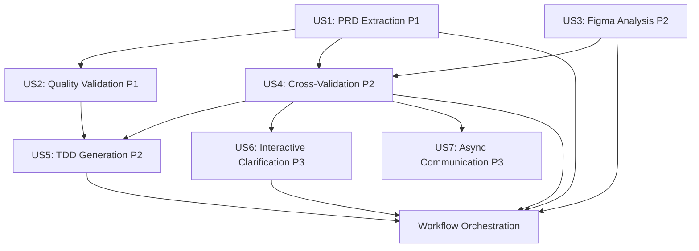

# Tasks: MT-PRISM AI Agent Plugin

**Input**: Design documents from `/home/james/Documents/Projects/ai/mt-prism/specs/001-prism-plugin/`
**Prerequisites**: plan.md, spec.md, research.md, data-model.md, contracts/

**Tests**: Test tasks included per constitution requirement (Test-First Development - NON-NEGOTIABLE). All tests must be written FIRST and verified to FAIL before implementation.

**Multi-Provider**: All skills must work identically across Claude, GPT-4, and Gemini (functionally equivalent outputs required, NFR-019).

**Organization**: Tasks are grouped by user story to enable independent implementation and testing of each story.

## Format: `[ID] [P?] [Story] Description`

- **[P]**: Can run in parallel (different files, no dependencies)
- **[Story]**: Which user story this task belongs to (e.g., US1, US2, US3)
- Include exact file paths in descriptions

## Path Conventions

Single project structure (AI agent plugin):
- `src/skills/` - 5 skill implementations
- `src/providers/` - LLM provider abstraction (anthropic, openai, google)
- `src/utils/` - Shared utilities (LLM abstraction layer, file operations, validation)
- `src/types/` - TypeScript type definitions
- `tests/` - Test files (unit, integration, provider-agnostic)
- `prompts/` - AI prompt templates
- `templates/` - Output schemas and TDD template

---

## Phase 1: Setup (Shared Infrastructure)

**Purpose**: Project initialization and basic structure

- [ ] T001 Create project structure with src/, tests/, prompts/, templates/ directories
- [ ] T002 Initialize Node.js project with package.json and TypeScript configuration
- [ ] T003 [P] Install dependencies: @anthropic-ai/sdk, openai, @google/generative-ai, yaml, zod, dotenv
- [ ] T004 [P] Install dev dependencies: vitest, tsx, @types/node, typescript
- [ ] T005 [P] Configure TypeScript with strict mode in tsconfig.json
- [ ] T006 [P] Configure Vitest test framework in vitest.config.ts
- [ ] T007 [P] Create .env.example with required API keys template
- [ ] T008 [P] Create .gitignore excluding node_modules, dist, .env, .prism/
- [ ] T009 Add npm scripts: start, build, test, dev in package.json

---

## Phase 2: Foundational (Blocking Prerequisites)

**Purpose**: Core infrastructure that MUST be complete before ANY user story can be implemented

**⚠️ CRITICAL**: No user story work can begin until this phase is complete

- [ ] T010 Create LLM provider abstraction layer in src/providers/ (anthropic.ts, openai.ts, google.ts, factory.ts, types.ts) with unified interface
- [ ] T010a Implement automatic provider fallback chain (Claude → GPT-4 → Gemini) with user notification in src/providers/factory.ts
- [ ] T010b Add provider selection configuration loading from .env (AI_PROVIDER, API keys) in src/providers/factory.ts
- [ ] T011 [P] Create prompt loader utility in src/utils/prompts.ts for loading templates
- [ ] T012 [P] Create file I/O utilities in src/utils/files.ts with atomic write operations (writeAtomic: temp → validate → rename pattern)
- [ ] T013 [P] Create MCP client base class in src/utils/mcp-client.ts
- [ ] T014 Create type definitions for Requirement in src/types/requirement.ts
- [ ] T015 [P] Create type definitions for Component in src/types/component.ts
- [ ] T016 [P] Create type definitions for Gap in src/types/gap.ts
- [ ] T017 [P] Create type definitions for Question in src/types/question.ts
- [ ] T018 [P] Create type definitions for Session in src/types/session.ts
- [ ] T019 Create Zod schemas for all types in src/schemas/ directory
- [ ] T020 [P] Copy prompt templates from /prompts/ to ensure they're accessible
- [ ] T021 [P] Copy output schemas from /templates/ to ensure they're accessible
- [ ] T022 Create session management utilities in src/utils/session.ts with 5 checkpoint boundaries (after PRD, Figma, validation, clarification, TDD completion)
- [ ] T023 [P] Create error handling utilities in src/utils/errors.ts with custom error classes

**Checkpoint**: Foundation ready - user story implementation can now begin in parallel

---

## Phase 3: User Story 1 - PRD Requirement Extraction (Priority: P1) 🎯 MVP

**Goal**: Extract and structure requirements from PRDs with 95%+ accuracy in <2 minutes

**Independent Test**: Run skill on sample Confluence PRD or local markdown file, verify structured requirements.yaml generated within 2 minutes

### Tests for User Story 1 (TDD - Write First)

- [ ] T024 [P] [US1] Create unit test for PRD Analyzer in tests/unit/prd-analyzer.test.ts (test requirement extraction from markdown)
- [ ] T025 [P] [US1] Create unit test for classification logic in tests/unit/prd-analyzer.test.ts (test priority/complexity assignment)
- [ ] T026 [P] [US1] Create unit test for ambiguity detection in tests/unit/prd-analyzer.test.ts (test "fast", "scalable" flagging)
- [ ] T027 [P] [US1] Create integration test with Confluence MCP in tests/integration/confluence-integration.test.ts
- [ ] T028 [P] [US1] Create test fixtures in tests/fixtures/sample-prd.md and tests/fixtures/sample-prd-with-ambiguities.md

### Implementation for User Story 1

- [ ] T029 [US1] Verify all US1 tests FAIL (requirement: tests written first, must fail before implementation)
- [ ] T030 [US1] Implement PRD Analyzer core function in src/skills/prd-analyzer.ts (analyzePRD function)
- [ ] T031 [US1] Implement requirement extraction logic using Claude prompt in src/skills/prd-analyzer.ts
- [ ] T032 [US1] Implement requirement classification (type, priority, category, complexity) in src/skills/prd-analyzer.ts
- [ ] T033 [US1] Implement ambiguity detection logic in src/skills/prd-analyzer.ts
- [ ] T034 [US1] Implement dependency mapping and graph generation in src/skills/prd-analyzer.ts
- [ ] T035 [US1] Add Confluence MCP integration for fetching PRDs in src/skills/prd-analyzer.ts
- [ ] T036 [US1] Add local file support (markdown, PDF via markitdown) in src/skills/prd-analyzer.ts
- [ ] T037 [US1] Implement YAML output generation using requirements schema in src/skills/prd-analyzer.ts
- [ ] T038 [US1] Implement Mermaid dependency graph generation in src/skills/prd-analyzer.ts
- [ ] T039 [US1] Implement human-readable analysis report generation in src/skills/prd-analyzer.ts
- [ ] T040 [US1] Add validation to ensure output matches requirements schema in src/skills/prd-analyzer.ts
- [ ] T041 [US1] Verify all US1 tests PASS (requirement: implementation complete when tests pass)

**Checkpoint**: PRD Analyzer fully functional - requirements can be extracted from any PRD source

---

## Phase 4: User Story 2 - Requirements Quality Validation (Priority: P1)

**Goal**: Validate requirement quality and completeness, detect issues before technical design

**Independent Test**: Provide requirements.yaml file, verify quality issues and missing information are detected

### Tests for User Story 2 (TDD - Write First)

- [ ] T042 [P] [US2] Create unit test for quality validation in tests/unit/quality-validator.test.ts (test missing acceptance criteria detection)
- [ ] T043 [P] [US2] Create unit test for vague language detection in tests/unit/quality-validator.test.ts
- [ ] T044 [P] [US2] Create unit test for dependency validation in tests/unit/quality-validator.test.ts
- [ ] T045 [P] [US2] Create test fixtures with various quality issues in tests/fixtures/

### Implementation for User Story 2

- [ ] T046 [US2] Verify all US2 tests FAIL
- [ ] T047 [US2] Implement quality validator function in src/skills/quality-validator.ts
- [ ] T048 [US2] Implement missing acceptance criteria detection in src/skills/quality-validator.ts
- [ ] T049 [US2] Implement vague language detector (fast, scalable, etc.) in src/skills/quality-validator.ts
- [ ] T050 [US2] Implement dependency graph validation and circular dependency detection in src/skills/quality-validator.ts
- [ ] T051 [US2] Implement issue reporting with severity levels in src/skills/quality-validator.ts
- [ ] T052 [US2] Add validation report generation in src/skills/quality-validator.ts
- [ ] T053 [US2] Verify all US2 tests PASS

**Checkpoint**: Requirements quality validation working - can identify gaps before design

---

## Phase 5: User Story 3 - Figma Design Analysis (Priority: P2)

**Goal**: Extract UI component specifications from Figma in <3 minutes with 95%+ accuracy

**Independent Test**: Provide Figma URL, verify components, design tokens, and UI patterns extracted

### Tests for User Story 3 (TDD - Write First)

- [ ] T054 [P] [US3] Create unit test for component extraction in tests/unit/figma-analyzer.test.ts
- [ ] T055 [P] [US3] Create unit test for design token extraction in tests/unit/figma-analyzer.test.ts
- [ ] T056 [P] [US3] Create unit test for UI pattern recognition in tests/unit/figma-analyzer.test.ts
- [ ] T057 [P] [US3] Create integration test with Figma MCP in tests/integration/figma-integration.test.ts
- [ ] T058 [P] [US3] Create test fixtures with sample Figma JSON data in tests/fixtures/sample-figma.json

### Implementation for User Story 3

- [ ] T059 [US3] Verify all US3 tests FAIL
- [ ] T060 [US3] Implement Figma MCP client in src/utils/figma-mcp.ts (if not available as package)
- [ ] T061 [US3] Implement Figma Analyzer core function in src/skills/figma-analyzer.ts (analyzeFigma function)
- [ ] T062 [US3] Implement component tree parsing and extraction in src/skills/figma-analyzer.ts
- [ ] T063 [US3] Implement atomic design classification (atom, molecule, organism) in src/skills/figma-analyzer.ts
- [ ] T064 [US3] Implement design token extraction (colors, typography, spacing) in src/skills/figma-analyzer.ts
- [ ] T065 [US3] Implement UI pattern recognition (forms, modals, tables) in src/skills/figma-analyzer.ts
- [ ] T066 [US3] Implement component screenshot generation via Figma API in src/skills/figma-analyzer.ts
- [ ] T067 [US3] Implement design system consistency checker in src/skills/figma-analyzer.ts
- [ ] T068 [US3] Implement YAML output generation using components schema in src/skills/figma-analyzer.ts
- [ ] T069 [US3] Implement design-tokens.json generation in src/skills/figma-analyzer.ts
- [ ] T070 [US3] Implement analysis report generation in src/skills/figma-analyzer.ts
- [ ] T071 [US3] Verify all US3 tests PASS

**Checkpoint**: Figma Analyzer fully functional - UI components can be extracted from any Figma file

---

## Phase 6: User Story 4 - Cross-Validation and Gap Detection (Priority: P2)

**Goal**: Identify gaps and inconsistencies between requirements and designs in <3 minutes

**Independent Test**: Provide requirements.yaml and components.yaml with known gaps, verify all major discrepancies detected

### Tests for User Story 4 (TDD - Write First)

- [ ] T072 [P] [US4] Create unit test for requirement-component mapping in tests/unit/validator.test.ts
- [ ] T073 [P] [US4] Create unit test for missing UI detection in tests/unit/validator.test.ts
- [ ] T074 [P] [US4] Create unit test for inconsistency detection in tests/unit/validator.test.ts
- [ ] T075 [P] [US4] Create unit test for question generation in tests/unit/validator.test.ts
- [ ] T076 [P] [US4] Create test fixtures with known gaps in tests/fixtures/requirements-with-gaps.yaml and components-incomplete.yaml

### Implementation for User Story 4

- [ ] T077 [US4] Verify all US4 tests FAIL
- [ ] T078 [US4] Implement Requirements Validator core function in src/skills/requirements-validator.ts (validateRequirements function)
- [ ] T079 [US4] Implement requirement-to-component mapping with confidence scoring in src/skills/requirements-validator.ts
- [ ] T080 [US4] Implement missing UI detection logic (Type 1 gaps) in src/skills/requirements-validator.ts
- [ ] T081 [US4] Implement no-requirement detection logic (Type 2 gaps) in src/skills/requirements-validator.ts
- [ ] T082 [US4] Implement incomplete mapping detection (Type 3 gaps) in src/skills/requirements-validator.ts
- [ ] T083 [US4] Implement inconsistency detection (Type 4 gaps) in src/skills/requirements-validator.ts
- [ ] T084 [US4] Implement missing acceptance criteria detection (Type 5 gaps) in src/skills/requirements-validator.ts
- [ ] T085 [US4] Implement clarification question generation with suggestions in src/skills/requirements-validator.ts
- [ ] T086 [US4] Implement stakeholder categorization (product, design, engineering) in src/skills/requirements-validator.ts
- [ ] T087 [US4] Implement traceability matrix generation in src/skills/requirements-validator.ts
- [ ] T088 [US4] Implement validation report, gaps.yaml, and questions.md generation in src/skills/requirements-validator.ts
- [ ] T089 [US4] Verify all US4 tests PASS

**Checkpoint**: Cross-validation working - can detect all major gap types between requirements and designs

---

## Phase 7: User Story 5 - Comprehensive TDD Generation (Priority: P2)

**Goal**: Generate complete TDD with all artifacts in <5 minutes

**Independent Test**: Provide validated requirements.yaml and components.yaml, verify comprehensive TDD generated

### Tests for User Story 5 (TDD - Write First)

- [ ] T090 [P] [US5] Create unit test for TDD section generation in tests/unit/tdd-generator.test.ts
- [ ] T091 [P] [US5] Create unit test for OpenAPI spec generation in tests/unit/tdd-generator.test.ts
- [ ] T092 [P] [US5] Create unit test for SQL schema generation in tests/unit/tdd-generator.test.ts
- [ ] T093 [P] [US5] Create unit test for task breakdown generation in tests/unit/tdd-generator.test.ts
- [ ] T094 [P] [US5] Create integration test for complete TDD workflow in tests/integration/tdd-workflow.test.ts

### Implementation for User Story 5

- [ ] T095 [US5] Verify all US5 tests FAIL
- [ ] T096 [US5] Implement TDD Generator core function in src/skills/tdd-generator.ts (generateTDD function)
- [ ] T097 [US5] Implement architecture decision logic (monolith vs microservices) in src/skills/tdd-generator.ts
- [ ] T098 [US5] Implement TDD template loader and section population in src/skills/tdd-generator.ts
- [ ] T099 [US5] Implement OpenAPI 3.1 specification generator from requirements in src/skills/tdd-generator.ts
- [ ] T100 [US5] Implement SQL database schema generator with indexes in src/skills/tdd-generator.ts
- [ ] T101 [US5] Implement TypeScript interfaces generator from API spec in src/skills/tdd-generator.ts
- [ ] T102 [US5] Implement Mermaid architecture diagram generator in src/skills/tdd-generator.ts
- [ ] T103 [US5] Implement task breakdown generator with effort estimates in src/skills/tdd-generator.ts
- [ ] T104 [US5] Implement security and performance section generators in src/skills/tdd-generator.ts
- [ ] T105 [US5] Implement TDD.md, api-spec.yaml, database-schema.sql output generation in src/skills/tdd-generator.ts
- [ ] T106 [US5] Add OpenAPI and SQL validation before output in src/skills/tdd-generator.ts
- [ ] T107 [US5] Verify all US5 tests PASS

**Checkpoint**: TDD Generator complete - can generate comprehensive technical docs from requirements

---

## Phase 8: User Story 6 - Interactive Clarification Workflow (Priority: P3)

**Goal**: Answer clarification questions interactively with clear prompts and automatic requirement updates

**Independent Test**: Trigger clarification with sample questions, verify answers collected and requirements updated

### Tests for User Story 6 (TDD - Write First)

- [ ] T108 [P] [US6] Create unit test for question presentation in tests/unit/clarification-manager.test.ts
- [ ] T109 [P] [US6] Create unit test for response collection in tests/unit/clarification-manager.test.ts
- [ ] T110 [P] [US6] Create unit test for requirement updates in tests/unit/clarification-manager.test.ts
- [ ] T111 [P] [US6] Create integration test for full interactive session in tests/integration/clarification-interactive.test.ts

### Implementation for User Story 6

- [ ] T112 [US6] Verify all US6 tests FAIL
- [ ] T113 [US6] Implement Clarification Manager core function in src/skills/clarification-manager.ts (clarify function)
- [ ] T114 [US6] Implement interactive mode question presenter in src/skills/clarification-manager.ts
- [ ] T115 [US6] Implement user input collection with validation in src/skills/clarification-manager.ts
- [ ] T116 [US6] Implement response parsing and storage in src/skills/clarification-manager.ts
- [ ] T117 [US6] Implement requirement update logic based on responses in src/skills/clarification-manager.ts
- [ ] T118 [US6] Implement re-validation trigger after updates in src/skills/clarification-manager.ts
- [ ] T119 [US6] Implement clarification session summary generation in src/skills/clarification-manager.ts
- [ ] T120 [US6] Verify all US6 tests PASS

**Checkpoint**: Interactive clarification working - can resolve ambiguities in real-time

---

## Phase 9: User Story 7 - Async Stakeholder Communication (Priority: P3)

**Goal**: Send clarification questions via Jira/Slack for async team collaboration

**Independent Test**: Configure Jira/Slack MCPs, verify questions posted successfully with proper formatting

### Tests for User Story 7 (TDD - Write First)

- [ ] T121 [P] [US7] Create integration test for Jira ticket creation in tests/integration/jira-integration.test.ts
- [ ] T122 [P] [US7] Create integration test for Slack message posting in tests/integration/slack-integration.test.ts
- [ ] T123 [P] [US7] Create unit test for question categorization by stakeholder in tests/unit/clarification-manager.test.ts

### Implementation for User Story 7

- [ ] T124 [US7] Verify all US7 tests FAIL
- [ ] T125 [US7] Implement Jira MCP client in src/utils/jira-mcp.ts
- [ ] T126 [P] [US7] Implement Slack MCP client in src/utils/slack-mcp.ts
- [ ] T127 [US7] Add Jira mode to Clarification Manager in src/skills/clarification-manager.ts (create issues)
- [ ] T128 [US7] Add Slack mode to Clarification Manager in src/skills/clarification-manager.ts (post messages)
- [ ] T129 [US7] Implement file export mode for manual distribution in src/skills/clarification-manager.ts
- [ ] T130 [US7] Implement stakeholder categorization and routing logic in src/skills/clarification-manager.ts
- [ ] T131 [US7] Verify all US7 tests PASS

**Checkpoint**: Async clarification working - can distribute questions via multiple channels

---

## Phase 10: Workflow Orchestration

**Goal**: Orchestrate all skills into complete end-to-end workflow with error handling and resume capability

**Independent Test**: Run full workflow end-to-end from PRD URL + Figma URL to complete TDD output

### Tests for Workflow Orchestration (TDD - Write First)

- [ ] T132 [P] Create end-to-end test for happy path (no clarifications) in tests/e2e/workflow-happy-path.test.ts
- [ ] T133 [P] Create end-to-end test for workflow with clarifications in tests/e2e/workflow-with-clarification.test.ts
- [ ] T134 [P] Create unit test for error handling and recovery in tests/unit/workflow-orchestrator.test.ts
- [ ] T135 [P] Create unit test for session resume functionality in tests/unit/workflow-orchestrator.test.ts

### Implementation for Workflow Orchestration

- [ ] T136 Verify all workflow tests FAIL
- [ ] T137 Implement workflow orchestrator in src/workflow/discover.ts (discover function)
- [ ] T138 Implement session initialization and state management in src/workflow/discover.ts
- [ ] T139 Implement sequential skill execution (PRD → Figma → Validate → Clarify → TDD) in src/workflow/discover.ts
- [ ] T140 Implement conditional clarification loop (iterate until validated) in src/workflow/discover.ts
- [ ] T141 Implement error handling with checkpoint saving in src/workflow/discover.ts
- [ ] T142 Implement resume capability from saved checkpoints in src/workflow/discover.ts
- [ ] T143 Implement progress reporting at each step in src/workflow/discover.ts
- [ ] T144 Implement workflow completion summary generation in src/workflow/discover.ts
- [ ] T145 Create CLI entry point in src/cli.ts for running workflows
- [ ] T146 Add command-line argument parsing for workflow options in src/cli.ts
- [ ] T147 Verify all workflow tests PASS

**Checkpoint**: Full workflow functional - complete PRD-to-TDD automation working end-to-end

---

## Phase 11: Polish & Cross-Cutting Concerns

**Purpose**: Final touches, performance optimization, and production readiness

- [ ] T148 [P] Add comprehensive error messages with recovery suggestions across all skills
- [ ] T149 [P] Implement caching layer for repeated PRD/Figma analyses in src/utils/cache.ts
- [ ] T150 [P] Add progress indicators and timing metrics to all skills
- [ ] T151 [P] Create user feedback collection after workflow completion in src/utils/feedback.ts
- [ ] T152 [P] Add metrics logging to .prism/metrics.jsonl in src/utils/metrics.ts
- [ ] T153 Run full test suite with all 3 AI providers (Claude, GPT-4, Gemini) and ensure 80%+ coverage across all skills
- [ ] T154 Create comprehensive README.md with installation, usage, and examples
- [ ] T155 Create example PRD and Figma files in examples/ directory for testing
- [ ] T156 Conduct beta testing with 3+ users and collect feedback
- [ ] T157 Address critical beta feedback and re-test
- [ ] T158 Create video walkthrough or tutorial documentation (optional)
- [ ] T159 Performance benchmark all skills against target times
- [ ] T160 Optimize slow paths identified in benchmarking
- [ ] T161 Final validation: Run complete workflow on real PRD and verify all success criteria met

**Checkpoint**: Plugin production-ready with all quality gates passed

---

## Dependencies & Execution Order

### User Story Dependencies

**Completion Order**:
1. **Phase 3 (US1)** must complete before US2, US4
2. **Phase 4 (US2)** can run in parallel with Phase 5 (US3)
3. **Phase 5 (US3)** must complete before US4
4. **Phase 6 (US4)** must complete before US5, US6, US7
5. **Phase 7 (US5)**, **Phase 8 (US6)**, **Phase 9 (US7)** can run in parallel
6. **Phase 10 (Workflow)** requires all user stories complete

### Parallel Execution Examples

**Week 1 (Setup + Foundation)**:
- All of Phase 1 and Phase 2 in sequence

**Week 2 (Core Analysis - P1)**:
- Phase 3 (US1): T024-T041 sequentially
- Then Phase 4 (US2): T042-T053 sequentially
- Phase 5 (US3): T054-T071 can start in parallel once US1 complete

**Week 3 (Validation & Generation - P2)**:
- Phase 6 (US4): T072-T089 after US1 and US3 complete
- Phase 7 (US5): T090-T107 after US4 complete

**Week 4 (Advanced Features - P3)**:
- Phase 8 (US6): T108-T120 in parallel with Phase 9
- Phase 9 (US7): T121-T131 in parallel with Phase 8
- Phase 10 (Workflow): T132-T147 after all stories complete

**Week 5 (Polish)**:
- Phase 11: T148-T161 (many parallelizable)

---

## Implementation Strategy

### MVP Scope (Minimum Viable Product)

**Deliver First** (Week 1-2):
- User Story 1 (PRD Extraction) - T024-T041
- User Story 2 (Quality Validation) - T042-T053

**MVP Value**: Developers can extract and validate requirements from PRDs, getting immediate value even without Figma analysis or TDD generation.

### Incremental Delivery

**Increment 1** (Week 1-2): MVP - PRD analysis and quality validation
- Delivers: Structured requirements from any PRD source
- Testable: Run on real PRDs, verify extraction accuracy
- Value: Saves hours of manual requirement documentation

**Increment 2** (Week 2-3): Add Figma and cross-validation
- User Story 3 (Figma Analysis)
- User Story 4 (Cross-Validation)
- Delivers: Component extraction + gap detection
- Value: Identifies requirement-design mismatches

**Increment 3** (Week 3-4): Add TDD generation
- User Story 5 (TDD Generation)
- Delivers: Complete automated TDD creation
- Value: Eliminates manual TDD writing

**Increment 4** (Week 4): Add advanced clarification
- User Story 6 (Interactive)
- User Story 7 (Async)
- Delivers: Multi-channel stakeholder communication
- Value: Streamlined clarification workflows

**Increment 5** (Week 4-5): Complete integration
- Workflow Orchestration
- Polish & Testing
- Delivers: Production-ready end-to-end automation
- Value: Complete PRD-to-TDD in <20 minutes

### Independent Testing Per Story

**US1**: Analyze sample-prd.md → Verify requirements.yaml has 5+ requirements with correct structure
**US2**: Load requirements-with-issues.yaml → Verify all known issues flagged
**US3**: Analyze sample Figma file → Verify components.yaml has 10+ components
**US4**: Load requirements + components with gaps → Verify all gaps detected
**US5**: Load validated requirements → Verify TDD.md, api-spec.yaml, database-schema.sql created
**US6**: Run with test questions → Verify interactive Q&A works and updates requirements
**US7**: Configure Jira/Slack → Verify tickets/messages created successfully

---

## Summary

**Total Tasks**: 163
- Setup: 9 tasks
- Foundational: 16 tasks (includes LLM provider abstraction with fallback chain)
- User Story 1 [P1]: 18 tasks (incl. 5 tests)
- User Story 2 [P1]: 12 tasks (incl. 4 tests)
- User Story 3 [P2]: 18 tasks (incl. 5 tests)
- User Story 4 [P2]: 18 tasks (incl. 5 tests)
- User Story 5 [P2]: 18 tasks (incl. 5 tests)
- User Story 6 [P3]: 12 tasks (incl. 4 tests)
- User Story 7 [P3]: 11 tasks (incl. 3 tests)
- Workflow Orchestration: 16 tasks (incl. 4 tests)
- Polish: 14 tasks

**Parallel Opportunities**: 47 tasks marked with [P] (29% parallelizable)

**Test Coverage**: 35 test tasks ensuring TDD compliance (80%+ coverage target, must pass with all 3 AI providers)

**Multi-Provider Support**: All skills tested with Claude, GPT-4, and Gemini for functional equivalence

**Estimated Timeline**: 4-5 weeks with 1-2 developers

**MVP**: User Stories 1-2 (PRD extraction + validation) - deliverable in Week 2
